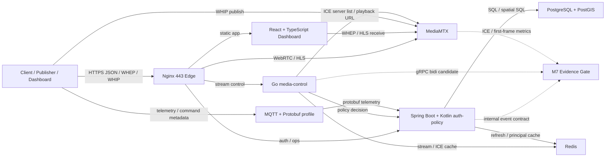

# GCS-Saker M7 final architecture evidence

## 목적

M7은 단순 기능 추가가 아니라 Python 중심 legacy runtime에서 Spring/Kotlin, Go, MediaMTX, coturn, PostgreSQL/PostGIS, Redis, MQTT, gRPC 후보가 역할을 나눠 갖는 구조 전환이다.

이 문서는 #421의 단일 재현 기준이다. 운영자가 아래 명령을 실행하면 현재 repo에서 확인 가능한 architecture evidence와 benchmark contract를 한 번에 볼 수 있다.

```bash
python3 scripts/m7_final_evidence_gate.py --run --timeout-seconds 120
```

## 최종 구조 요약



## evidence gate 항목

| category | command | 증명하는 것 |
| --- | --- | --- |
| release-readiness | `v2_completion_gate` | 남은 release blocker와 non-blocking migration item을 구분한다. |
| architecture-evidence | `architecture_intent_gate` | 설계 의도와 실제 파일/route/protocol evidence path가 연결되어 있다. |
| performance-contract | `m7_performance_benchmark_matrix --check` | API/HLS/WebRTC/ICE benchmark metric 이름이 고정되어 있다. |
| db-throughput | `telemetry_bulk_flush_benchmark` | telemetry bulk write path의 statement 감소와 synthetic throughput을 재현한다. |
| streaming-low-latency | `webrtc_ice_smoke --check` | selected ICE pair, direct/relay ratio, fallback reason 계약이 있다. |
| protocol-runtime | `grpc_runtime_smoke --run` | gRPC gateway proto descriptor와 internal bidi streaming 계약이 검증된다. |
| ai-overlay | `ai_overlay_sidecar_smoke --run` | AI overlay는 media frame이 아니라 metadata event path로 분리된다. |
| mqtt-control-plane | `mqtt_hardened_profile_smoke --check` | MQTT는 telemetry/control metadata용이며 media frame을 운반하지 않는다. |
| closed-network | `closed_network_static_check` | 폐쇄망 env, offline map, internal STUN/TURN/time, offline artifact runbook이 검증된다. |
| compose-integration | `docker compose config --quiet` | 기본/폐쇄망 compose model이 해석된다. |

## 2026-06-26 local evidence run

`scripts/m7_final_evidence_gate.py --run --timeout-seconds 120` 결과는 전체 required command가 통과했다.

주요 수치:

| metric | value |
| --- | ---: |
| telemetry synthetic records | 1000 |
| telemetry batch size | 100 |
| telemetry ingest latency | 2.964 ms |
| telemetry ingest throughput | 337,329 records/sec |
| telemetry flush latency | 106.910 ms |
| telemetry flush throughput | 9,353 records/sec |
| PostgreSQL avoided statements | 980 |
| MySQL avoided statements | 990 |
| ICE static direct ratio contract | 0.5000 |
| ICE static relay ratio contract | 0.5000 |
| AI overlay protobuf bytes | 199 |

주의:

- telemetry 수치는 실제 DB capacity claim이 아니라 synthetic compile-only benchmark다.
- ICE ratio는 static contract sample이다. 실제 relay ratio는 외부 NAT 또는 폐쇄망 장비 smoke에서 별도로 측정한다.
- Docker compose config는 local Docker CLI가 있는 환경에서 통과했다.

## 남은 최적화와 위험

| area | 남은 작업 | 위험 |
| --- | --- | --- |
| live benchmark | legacy/v0.2.0/M7을 같은 외부 stream 조건에서 반복 측정 | 과거 baseline과 현재 서버 조건이 달라 직접 비교가 왜곡될 수 있다. |
| WebRTC | 외부 NAT multi-minute soak, relay ratio 실측, audio/video sync 측정 | TURN relay 비율이 높으면 대역폭과 port range가 먼저 병목이 된다. |
| DB | live PostgreSQL WAL/lock/buffer 영향 측정 | synthetic throughput을 운영 DB 수치로 오해하면 안 된다. |
| closed-network | 실제 air-gapped image load, internal STUN/TURN, internal time source smoke | Docker/CA/방화벽 정책은 현장마다 다르다. |
| GraphQL | 큰 read model에만 적용할지 final decision 필요 | REST와 GraphQL이 무분별하게 섞이면 frontend state contract가 흐려진다. |
