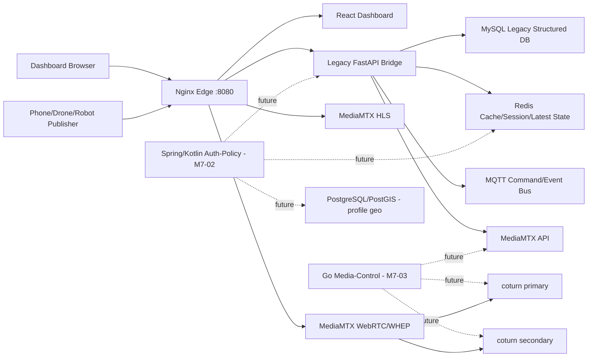
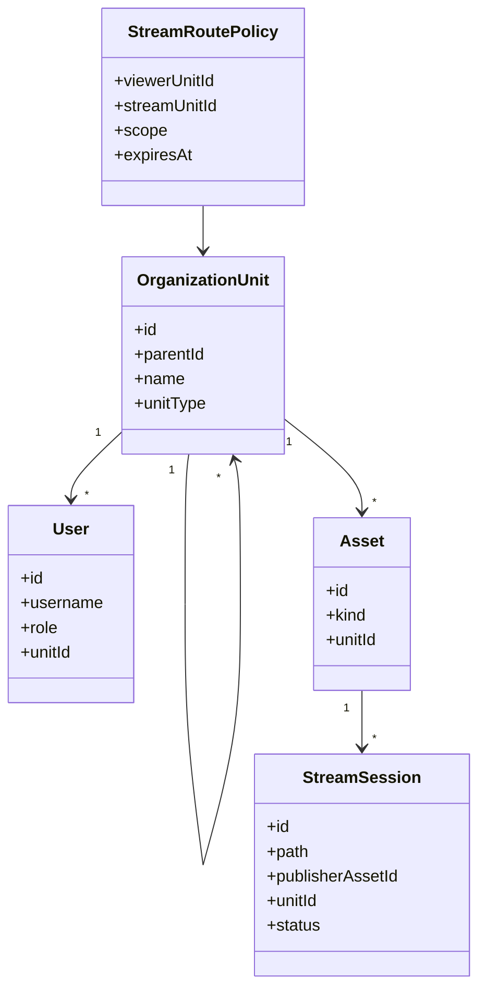

# GCS-Saker M7 Single-node Architecture PoC

## 목적

M7 이전 PoC는 운영 중인 `v0.2.0` 계열을 바로 흔들지 않고, 한 대 서버 안에서 Spring/Kotlin, Go, MediaMTX, coturn, DB 역할 분리가 가능한지 검증한다. 두 서버 분산은 이 구조가 한 서버에서 정상 동작한 뒤 진행한다.

## 기본 판단

- 첫 목표는 single-node appliance다.
- 공개망보다 폐쇄망을 기본값으로 둔다.
- 외부 STUN, CDN, 외부 지도 API, 외부 package registry에 의존하지 않는다.
- media packet은 application server를 통과시키지 않는다.
- 인증/인가와 group policy는 control plane에서 판단한다.
- MediaMTX/coturn은 media plane으로 유지한다.

## 구조도



## 서비스 구동 순서

1. `mysql-legacy`, `redis`
2. `mqtt`
3. `turn-primary`, `turn-secondary`
4. `mediamtx`
5. `auth-policy` future profile
6. `backend`
7. `dashboard`
8. `edge`

`auth-policy`는 M7-02에서 Spring/Kotlin skeleton으로 구현한다. `media-control`은 M7-03에서 Go skeleton으로 구현하며, MediaMTX/coturn adapter와 stream/ICE contract를 담당한다.

## 네트워크

| 네트워크 | 포함 서비스 | 목적 |
| --- | --- | --- |
| `control-net` | edge, dashboard, backend, mysql, redis, future auth-policy | 인증/인가, API, 서버 상태 |
| `media-net` | edge, backend, mediamtx, coturn, mqtt, future media-control | stream control, media signaling, TURN |

single-node라도 control plane과 media plane을 논리적으로 나눠서, 이후 두 서버 분산 시 포트와 방화벽 기준을 명확히 한다.

## DB 역할 분리와 M7-05 데이터 플랫폼 판단

M7-05의 결론은 “single-node PoC 기본값은 MySQL + Redis로 유지하고, 좌표/geometry는 `geo` profile의 PostgreSQL/PostGIS로만 검증한다”이다. 운영 중인 `v0.2.0` 데이터와 인증 흐름을 흔들지 않으면서도, 폐쇄망 납품에서 필요한 geometry/time-series 확장 지점을 미리 분리하기 위한 선택이다.

| 데이터 | M7 기본 저장소 | 확장 후보 | 판단 |
| --- | --- | --- | --- |
| 사용자, 회사, legacy auth/API | MySQL 8 | PostgreSQL migration | 현재 운영 코드와 ORM 호환성이 가장 중요하므로 유지한다. 이전은 schema parity와 백업/복구 절차가 생긴 뒤 별도 milestone에서만 진행한다. |
| refresh/session/cache/latest status | Redis 7 | Redis Sentinel/cluster | polling, access decision cache, ICE server list cache, latest stream presence처럼 짧은 TTL 데이터에만 사용한다. media frame은 Redis에 올리지 않는다. |
| 좌표, geometry, geofence | MySQL legacy field 유지 | PostgreSQL/PostGIS `geo` profile | 거리/포함/교차 query가 늘어나는 시점부터 PostGIS GiST/SP-GiST index를 사용한다. M7에서는 compose profile로만 검증한다. |
| 비정형 event, AI result, operator note | MySQL JSON column 또는 app log | PostgreSQL JSONB, OpenSearch, MongoDB | single-node 복잡도를 줄이기 위해 검색 전문 저장소는 후순위다. 운영 검색/필터가 병목이면 OpenSearch를 재검토한다. |
| 고빈도 telemetry/time-series | Redis latest + MySQL snapshot | TimescaleDB/PostgreSQL partition | 초당 telemetry가 늘면 최신값은 Redis, 이력은 time bucket/partition 저장소로 분리한다. M3/M5 부하 테스트 전에는 DB를 늘리지 않는다. |
| 큰 media artifact, snapshot, VOD | 파일/MediaMTX path | MinIO/S3-compatible | 영상 원본을 RDB에 넣지 않는다. 녹화/VOD가 들어오면 object storage를 별도 profile로 검토한다. |

### 최소 구성

M7 single-node 기본 compose는 아래 저장소만 반드시 필요하다.

1. `mysql-legacy`: 기존 계정, 회사, gateway, asset, telemetry realtime 호환 데이터
2. `redis`: refresh/session, principal cache, ICE server list cache, stream presence/latest state

`postgres-geo`는 `geo` profile이다. 즉, 기본 설치에서 항상 뜨는 DB가 아니다. 폐쇄망 납품 시 운영 복잡도, 백업 정책, 디스크 용량을 늘리기 전에 geometry query 이득이 실제로 확인되어야 한다.

### Geometry 최적화 전략

지도/드론/로봇 위치 기능이 커지면 단순 위도/경도 컬럼만으로는 아래 연산이 비싸진다.

- 특정 반경 안의 asset/stream 조회
- geofence 내부/외부 판정
- 드론 경로와 제한구역 교차 판정
- 선택 stream의 최근 궤적 query

PostGIS 도입 시 기본 모델은 다음 순서로 잡는다.

1. `asset_position(asset_id, observed_at, geom POINT, heading, altitude)`
2. `geofence(id, group_id, geom POLYGON/MULTIPOLYGON, status)`
3. `stream_track(stream_id, observed_at, geom POINT, speed, altitude)`
4. `GIST(geom)` 공간 인덱스와 `BTREE(group_id, observed_at)` 보조 인덱스

이렇게 하면 application이 모든 좌표를 가져와 직접 거리 계산을 하지 않고, DB가 공간 인덱스로 후보 row를 먼저 줄인다. 기대 효과는 “전체 좌표 N건 scan”에서 “bounding box 후보 K건 + 정확한 geometry 계산”으로 바뀌는 것이다.

### Time-series 저장 전략

telemetry는 모든 값을 같은 테이블에 무한히 쌓으면 write amplification, index bloat, 오래된 row scan 문제가 생긴다. M7에서는 최신값만 빠르게 보여주는 것이 우선이므로 Redis latest cache를 사용하고, 이력 저장은 아래 조건이 충족될 때 분리한다.

- 한 stream이 1초에 여러 telemetry sample을 지속적으로 전송한다.
- 운영자가 특정 시간 범위의 telemetry replay/분석을 요구한다.
- geofence 위반, AI overlay, 음성/영상 timestamp 정렬에 과거 sample 조회가 필요하다.

확장 시에는 PostgreSQL partition 또는 TimescaleDB hypertable을 검토한다. query는 `stream_id + observed_at range`를 기본 access path로 두고, dashboard는 no-offset cursor 방식으로 조회한다.

### 기존 MySQL 이전 여부와 리스크

지금 MySQL을 즉시 PostgreSQL로 옮기지 않는 이유는 명확하다.

- 운영 서버에서 이미 동작하는 schema와 ORM query가 있다.
- 인증/인가 문제는 DB 교체보다 session/JWT/권한 contract 안정화가 더 급하다.
- DB migration은 rollback, dump/restore, charset/timezone, unique constraint 차이를 동반한다.
- 폐쇄망 납품에서는 DB 종류 증가가 설치/백업/장애 대응 비용을 바로 올린다.

따라서 M7의 방침은 “legacy structured data는 유지, geometry/time-series만 profile로 검증”이다. PostgreSQL/PostGIS가 확정되는 시점에도 사용자/권한 전체 이전이 아니라 geometry bounded context부터 분리한다.

### 비정형 데이터와 검색 저장소 판단

AI result, event log, operator note는 형태가 자주 바뀔 수 있다. 다만 M7에서 OpenSearch/MongoDB를 바로 넣지 않는 이유는 다음과 같다.

- single-node appliance 기본 메모리와 운영 부담이 증가한다.
- 폐쇄망 패키징 시 image와 백업 대상이 늘어난다.
- 현재 검색 요구는 이벤트 로그 필터 수준이라 RDB/JSON column + index로 먼저 검증 가능하다.

추후 event text search, 다중 조건 aggregation, 장기 로그 보존이 병목으로 확인되면 OpenSearch를 “운영 검색 profile”로 추가한다.

## Group/Stream Routing 도메인 초안



기본 정책:

- 대대는 하위 중대/소대 stream을 조회할 수 있다.
- 중대는 자기 중대 stream만 기본 조회한다.
- 임시 공유는 `StreamRoutePolicy`로 열고 만료 시간을 둔다.
- stream list API는 사용자 group scope에 따라 필터링된 결과만 반환한다.

M7-04에서 auth-policy domain에 고정한 route scope:

| Scope | 의미 | 사용 예 |
| --- | --- | --- |
| `SAME_GROUP` | 특정 viewer group이 특정 publisher group의 stream만 조회 | 중대 내부 공유 |
| `DESCENDANT_GROUPS` | 특정 publisher group과 하위 group stream까지 조회 | 대대/중대 지휘관 화면 |
| `CROSS_GROUP` | 형제/타 부대 stream을 만료 시간 기준으로 임시 조회 | 합동 작전/상황 전파 |

stream routing은 인증/인가 domain에서 먼저 판단하고, media-control은 허용된 stream registry와 ICE 정보만 제공하는 방향으로 둔다. 즉, media-control은 group 권한을 직접 결정하지 않고 auth-policy의 decision을 소비하는 쪽으로 확장한다.

## GraphQL 검토 위치

GraphQL은 media path에 넣지 않는다. 후보 위치는 dashboard BFF다.

적합한 경우:

- dashboard가 group, asset, stream, telemetry summary를 한 번에 조합해야 한다.
- 권한 필터링된 tree query가 복잡해진다.

부적합한 경우:

- WebRTC/WHEP/HLS 송수신
- 고빈도 telemetry ingest
- 단순 CRUD

M7-06에서 REST + TanStack Query, GraphQL BFF, gRPC 내부 호출을 비교한다.

## 실행

```bash
cd /Users/taetae/Documents/gcs-saker-arch-poc
cp deploy/compose/.env.single-node.example deploy/compose/.env.single-node
docker compose --env-file deploy/compose/.env.single-node -f deploy/compose/compose.single-node.poc.yml config
```

실제 기동은 M7-01 검증 후 진행한다.
