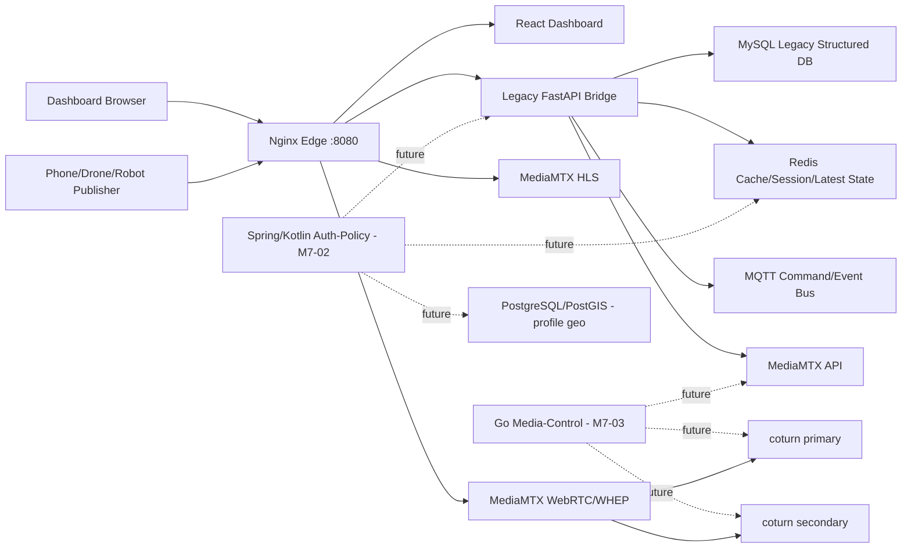
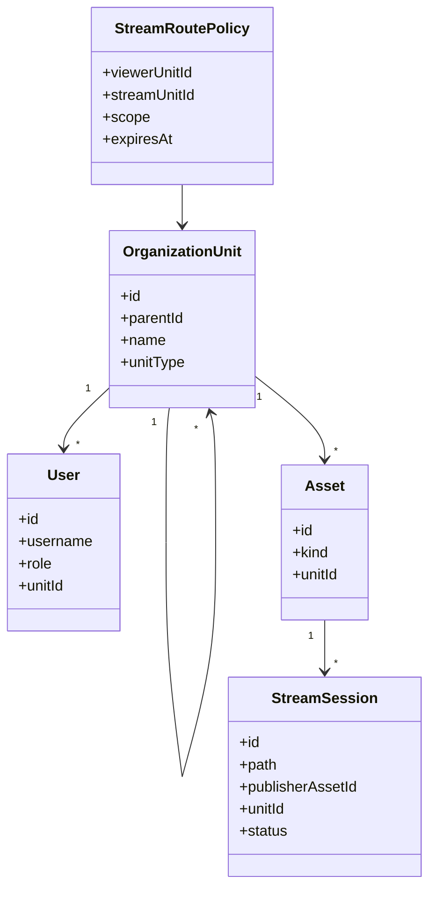

# GCS-Saker M7 Single-node Architecture PoC

## 목적

M7 이전 PoC는 운영 중인 `v0.2.0` 계열을 바로 흔들지 않고, 한 대 서버 안에서 Spring/Kotlin, Go, MediaMTX, coturn, DB 역할 분리가 가능한지 검증한다. 두 서버 분산은 이 구조가 한 서버에서 정상 동작한 뒤 진행한다.

## 기본 판단

- 첫 목표는 single-node appliance다.
- 공개망보다 폐쇄망을 기본값으로 둔다.
- 외부 STUN, CDN, 외부 지도 API, 외부 package registry에 의존하지 않는다.
- media packet은 application server를 통과시키지 않는다.
- 인증/인가와 group policy는 control plane에서 판단한다.
- MediaMTX/coturn은 media plane으로 유지한다.

## 구조도



## 서비스 구동 순서

1. `mysql-legacy`, `redis`
2. `mqtt`
3. `turn-primary`, `turn-secondary`
4. `mediamtx`
5. `auth-policy` future profile
6. `backend`
7. `dashboard`
8. `edge`

`auth-policy`는 M7-02에서 Spring/Kotlin skeleton으로 구현한다. `media-control`은 M7-03에서 Go skeleton으로 구현하며, MediaMTX/coturn adapter와 stream/ICE contract를 담당한다.

## 네트워크

| 네트워크 | 포함 서비스 | 목적 |
| --- | --- | --- |
| `control-net` | edge, dashboard, backend, mysql, redis, future auth-policy | 인증/인가, API, 서버 상태 |
| `media-net` | edge, backend, mediamtx, coturn, mqtt, future media-control | stream control, media signaling, TURN |

single-node라도 control plane과 media plane을 논리적으로 나눠서, 이후 두 서버 분산 시 포트와 방화벽 기준을 명확히 한다.

## DB 역할 분리 초안

| 데이터 | 1차 저장소 | 이유 |
| --- | --- | --- |
| 기존 사용자/회사/legacy API | MySQL | 현재 운영 코드와 호환 |
| session/cache/latest status | Redis | polling과 최신 상태 조회 비용 감소 |
| 좌표/geometry/geofence | PostgreSQL/PostGIS 후보 | 공간 인덱스와 geometry query에 유리 |
| 비정형 event/AI result | JSONB 우선, 이후 OpenSearch/MongoDB 검토 | single-node 복잡도 억제 |
| time-series telemetry | Redis latest + PostGIS/TimescaleDB 후보 | M3/M5 부하 테스트 후 확정 |

M7-01에서는 DB를 무리하게 늘리지 않는다. `postgres-geo`는 `geo` profile로만 두고, 실제 도입은 M7-05에서 검증한다.

## Group/Stream Routing 도메인 초안



기본 정책:

- 대대는 하위 중대/소대 stream을 조회할 수 있다.
- 중대는 자기 중대 stream만 기본 조회한다.
- 임시 공유는 `StreamRoutePolicy`로 열고 만료 시간을 둔다.
- stream list API는 사용자 group scope에 따라 필터링된 결과만 반환한다.

## GraphQL 검토 위치

GraphQL은 media path에 넣지 않는다. 후보 위치는 dashboard BFF다.

적합한 경우:

- dashboard가 group, asset, stream, telemetry summary를 한 번에 조합해야 한다.
- 권한 필터링된 tree query가 복잡해진다.

부적합한 경우:

- WebRTC/WHEP/HLS 송수신
- 고빈도 telemetry ingest
- 단순 CRUD

M7-06에서 REST + TanStack Query, GraphQL BFF, gRPC 내부 호출을 비교한다.

## 실행

```bash
cd /Users/taetae/Documents/gcs-saker-arch-poc
cp deploy/compose/.env.single-node.example deploy/compose/.env.single-node
docker compose --env-file deploy/compose/.env.single-node -f deploy/compose/compose.single-node.poc.yml config
```

실제 기동은 M7-01 검증 후 진행한다.
