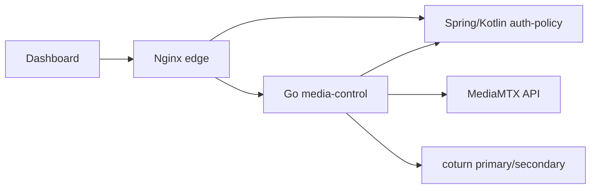

# GCS-Saker M7 Stream Policy Enforcement

## 목적

M7-10A는 Dashboard가 Go `media-control`로 stream API를 전환한 뒤에도 인증/인가 경계가 유지되는지 검증하는 단계다. 이전 구조에서는 stream list/playback/status가 Go API에서 MediaMTX 상태만 보고 응답했기 때문에, Spring/Kotlin `auth-policy`가 발급한 JWT와 group scope가 stream 선택 단계에 반영되지 않았다.

## 적용 구조

## 처리 순서

1. Dashboard는 `/auth-policy/auth/login`으로 로그인하고 access token을 보관한다.
2. Dashboard는 `/media-control/api/v1/streams` 요청에 `Authorization: Bearer ...`를 붙인다.
3. Go `media-control`은 MediaMTX stream path를 dashboard `streamId`와 `publisherGroupId`로 변환한다.
4. Go `media-control`은 Spring/Kotlin `auth-policy`의 `POST /policy/streams/access`로 권한 결정을 요청한다.
5. 목록에서는 허용된 stream만 반환하고, 단건 playback/status는 인증 실패 `401`, 권한 실패 `403`을 반환한다.

## 운영 변수

- `AUTH_POLICY_BASE_URL`: media-control이 호출할 auth-policy 내부 주소
- `MEDIA_CONTROL_DEFAULT_PUBLISHER_GROUP_ID`: 매핑이 없는 stream의 기본 발행 group
- `MEDIA_CONTROL_STREAM_GROUP_MAP`: `raw/sample/front=co-a` 형식의 stream path/group 매핑
- `VITE_AUTH_API_BASE_URL`: M7 single-node에서는 `/auth-policy/auth`
- `VITE_STREAM_API_BASE_URL`: M7 single-node에서는 `/media-control`

## 남은 이전 항목

- auth-policy in-memory user/group repository를 DB repository로 교체
- Python auth/stream API를 운영 경로에서 제거하거나 legacy profile로 격리
- device identity와 stream publisher group 매핑을 수동 env에서 등록형 API/DB로 이전
- NAT 외부망 WebRTC, TURN fallback, 장시간 soak에서 정책 호출 latency 측정
