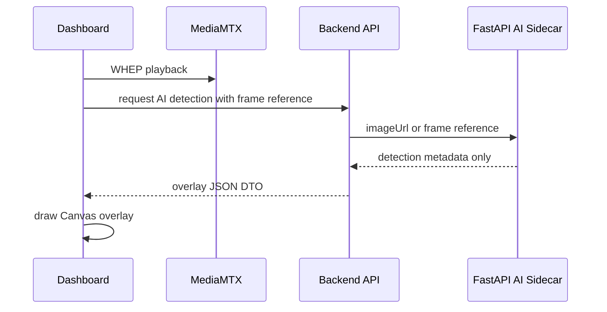

# GCS-Saker M8 AI Sidecar Overlay Contract

## 목적

AI sidecar는 기본 WebRTC media path를 중계하지 않는다. 영상과 음성은 MediaMTX/WebRTC 경로를 유지하고, AI sidecar는 frame reference를 받아 detection/overlay metadata만 반환한다.

## 적용 범위

- 적용: mock detection, overlay metadata, risk score, event log message
- 제외: WebRTC RTP 중계, HLS segment 중계, raw frame response, browser playback 대체
- 후보: FastAPI local sidecar, 향후 LangChain/LangGraph job orchestration

## 데이터 흐름



## 계약 원칙

- response는 `schemaVersion`, `streamId`, `frame`, `generatedAt`, `riskScore`, `reportText`, `detections`만 포함한다.
- response에는 `frameDataBase64`, raw image bytes, video chunk, audio bytes를 넣지 않는다.
- bbox 좌표는 0~1 normalized frame coordinate다.
- AI sidecar 장애는 overlay unavailable 상태로 격리하고, stream playback은 유지한다.
- 외부 LLM/API 의존은 기본 경로에 넣지 않는다. 폐쇄망에서는 local model 또는 mock provider로 시작한다.

## 장애 기준

- sidecar timeout: retryable error DTO를 반환한다.
- sidecar down: dashboard는 AI overlay를 숨기고 stream card를 유지한다.
- malformed response: backend contract validation에서 거부한다.
- model latency 증가: stream playback이 아니라 overlay freshness만 degraded 처리한다.

## 후속 구현

## M7 mock runtime smoke

M7에서는 실제 AI model server를 띄우지 않고, mock sidecar path가 media path와 분리되어 있는지만 검증한다.

```bash
python3 scripts/ai_overlay_sidecar_smoke.py --run
```

이 smoke는 다음을 확인한다.

- mock AI detection response가 dashboard JSON DTO 형태를 유지한다.
- dashboard detection이 내부 `AiOverlayEvent` protobuf metadata event로 변환된다.
- `AiOverlayEvent` protobuf가 다시 dashboard JSON DTO로 복원된다.
- AI sidecar path는 media frame, video chunk, audio bytes를 운반하지 않는다.
- stream id가 다른 overlay event는 dashboard response로 섞이지 않는다.

## 후속 구현

1. FastAPI sidecar를 backend process에서 분리한다.
2. `AiOverlayEvent` protobuf를 내부 broker에 publish하는 adapter를 추가한다.
3. dashboard Canvas overlay에서 detection DTO와 `AiOverlayEvent` 변환 결과를 같은 renderer로 그린다.
4. AI sidecar down integration test와 overlay fallback UI를 추가한다.
