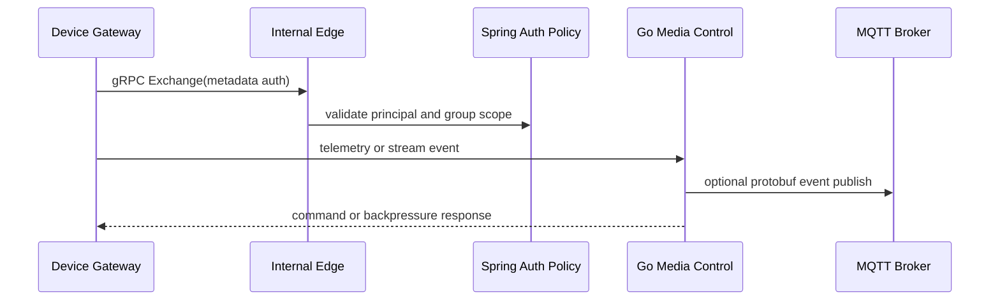

# GCS-Saker M8 gRPC Internal Streaming Contract

## 목적

gRPC bidirectional streaming은 browser dashboard가 아니라 service-to-service, native/mobile, device gateway 후보로 검증한다. Dashboard는 현재처럼 REST/JSON과 WebRTC WHEP/WHIP 경로를 유지한다.

## 적용 범위

- 적용 대상: device gateway, Spring/Kotlin auth-policy, Go media-control, native/mobile gateway 후보
- 제외 대상: browser dashboard direct gRPC, WebRTC media frame transport, HLS fallback
- 인증: payload field가 아니라 gRPC metadata에 bearer token 또는 device credential을 싣는다.

## 서비스 계약

`SakerGatewayService.Exchange`

- client streaming: device/gateway가 telemetry, stream session event, command ack를 보낸다.
- server streaming: server가 command, batched telemetry, backpressure/reconnect status를 보낸다.
- payload는 `oneof`로 분리해 타입 오사용을 줄인다.

## Flow

## Backpressure 기준

- server queue가 임계치를 넘으면 `GATEWAY_ACK_STATUS_BACKPRESSURE`를 반환한다.
- client는 exponential backoff와 jitter를 적용한다.
- media frame은 이 경로에 올리지 않는다.

## Reconnect 기준

- stream이 끊기면 client는 마지막 acked request id를 기준으로 재연결한다.
- server는 중복 `request_id`를 idempotent하게 처리해야 한다.
- reconnect 상태는 dashboard event log에는 JSON DTO로 변환되어 노출된다.

## 후속 구현 순서

1. Go media-control에 internal `SakerGatewayService.Exchange` endpoint를 붙인다. 완료.
2. Python runtime smoke와 MessageSender metadata path를 붙인다. 완료.
3. malformed protobuf, unauthorized metadata, backpressure, reconnect integration test를 추가한다. 완료.
4. 폐쇄망 compose profile에서 gRPC port를 내부 network에만 노출한다. 완료.
5. proto codegen 또는 명시 mapper 경로를 Kotlin/Go/Python에 고정한다. 남음.
6. Spring/Kotlin auth metadata interceptor와 native/device gateway client를 붙인다. 남음.
7. 장시간 bidi stream backpressure/reconnect soak를 통과시킨다. 남음.
