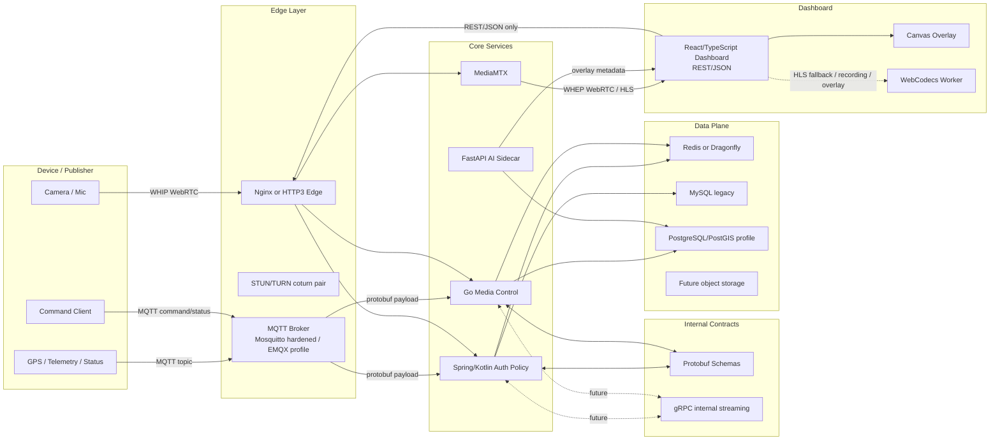
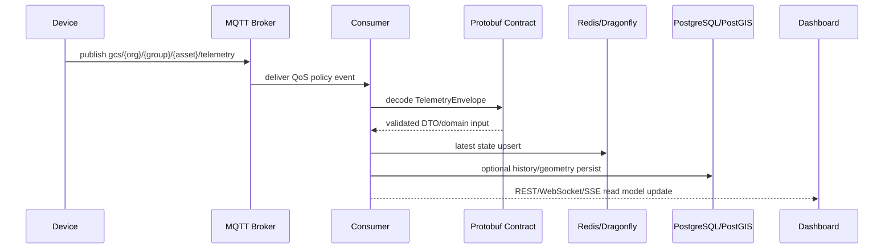
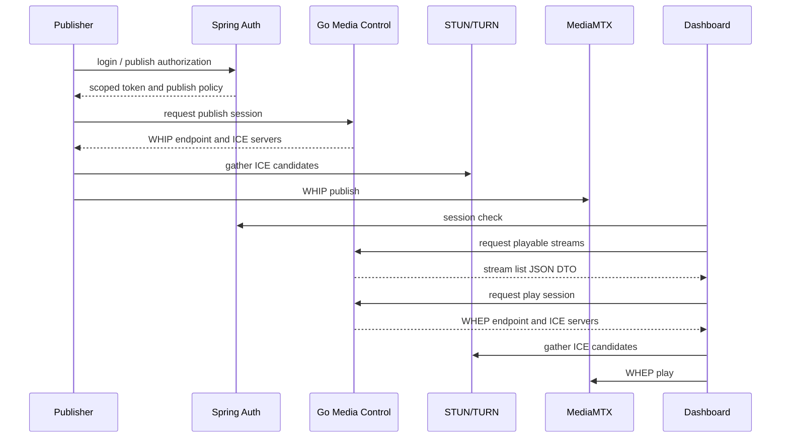
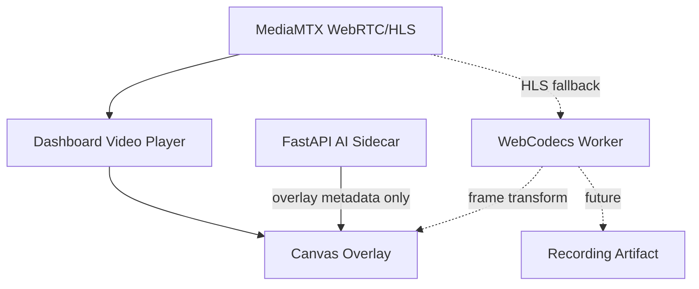

# GCS-Saker M8 Local Protocol Migration Plan

## 결정 사항

Supabase 도입은 중단한다. Elasticsearch/Kibana는 TURN, 네트워크, 운영 로그 분석에는 가치가 있지만 핵심 스트리밍 경로를 빠르게 만들지는 않으므로 최후순위 관측성 profile로 미룬다.

M8의 최우선 목표는 로컬 환경에서 아래 기술을 단계적으로 migration하고, 기존 기능이 깨지지 않는지 매 단계마다 검증하는 것이다.

- MQTT broker: Spring 서버 앞에서 telemetry, device status, command event를 흡수한다.
- Protobuf: dashboard 연결을 제외한 내부 service/device 계약에 도입한다.
- gRPC bidirectional streaming: browser dashboard가 아니라 service-to-service, native/mobile, device gateway 후보로 검증한다.
- Dragonfly: Redis compatible runtime으로 cache/session/ICE list 경로 호환성을 검증한다.
- FastAPI + LangChain/LangGraph: media path가 아닌 AI sidecar와 overlay job orchestration 후보로 둔다.
- WebCodecs + Canvas: HLS fallback, 녹화, AI overlay를 위한 browser media processing 후보로 검증한다.
- HTTP/3: edge profile에서 dashboard/API/HLS/WHEP signaling 최적화 후보로 검증한다. WebRTC media 자체를 대체하지 않는다.
- PostgreSQL/PostGIS: Supabase 없이 geometry, route, telemetry history bounded context부터 검증한다.

## 목표 구조

## Flow 1. Telemetry 흡수 경로

원칙:

- media frame은 MQTT에 태우지 않는다.
- GPS, battery, heading, device health, command ack만 MQTT로 흡수한다.
- topic ACL은 org/group/asset 단위로 묶는다.
- Protobuf field는 reserved rule을 지켜 후방 호환성을 유지한다.

## Flow 2. Stream publish/play 경로

원칙:

- dashboard는 JSON DTO를 유지한다.
- Protobuf/gRPC는 device gateway, Spring, Go, AI sidecar 사이 내부 계약에만 사용한다.
- TURN relay 비율이 올라가면 media path를 바꾸기보다 ICE 후보, NAT, UDP 포트, TURN capacity를 먼저 분석한다.

## Flow 3. AI overlay / HLS fallback / Recording

원칙:

- AI sidecar는 영상을 직접 중계하는 기본 경로가 아니다.
- overlay는 metadata를 받아 Canvas에 그린다.
- WebCodecs는 feature detection을 통과한 브라우저에서만 사용한다.
- fallback은 기존 video/HLS 경로를 유지한다.

## 최우선 이슈 분해

### M8-01 MQTT broker hardening and topic ACL

목표:

- 현재 `mosquitto-no-auth` 구성을 운영 불가 상태로 표시한다.
- 로컬 hardened Mosquitto profile을 추가한다.
- EMQX는 scale/cluster profile 후보로 분리한다.
- topic namespace와 ACL을 문서와 테스트 fixture로 고정한다.

테스트:

- 허용 topic publish 성공
- 금지 topic publish 실패
- 잘못된 client id 거부
- broker down 시 Spring/Go degraded behavior

### M8-02 Protobuf internal contract package

목표:

- `telemetry.proto`, `stream_control.proto`, `ops_event.proto`, `ai_overlay.proto`를 추가한다.
- Kotlin/Go/Python codegen 경로를 고정한다.
- dashboard REST/JSON DTO와 내부 Protobuf DTO를 분리한다.

테스트:

- schema lint
- golden binary fixture decode
- backward compatibility reserved field test
- Kotlin/Go/Python DTO round-trip

### M8-03 MQTT to Spring/Go consumer bridge

목표:

- MQTT message를 Protobuf로 decode해 latest telemetry read model에 반영한다.
- Spring은 auth/policy/event 쪽, Go는 stream/media-control read model 쪽으로 역할을 나눈다.

테스트:

- MQTT publish -> consumer -> cache upsert
- malformed protobuf reject
- duplicate event id idempotency
- consumer restart 후 재구독

### M8-04 Dragonfly compatibility profile

목표:

- Redis 기본값을 유지하되 Dragonfly compose profile을 추가한다.
- refresh session, principal cache, ICE server list cache, stream presence가 Redis protocol subset만 사용하는지 검증한다.
- telemetry latest state와 history queue를 분리하는 write buffer 후보로 Dragonfly를 검증한다.

테스트:

- Redis profile 전체 통과
- Dragonfly profile 전체 통과
- Redis/Dragonfly 장애 시 degraded behavior 동일성
- write buffer drain/restore contract

주의:

- Dragonfly는 기술적으로 Redis 호환성이 좋지만 라이선스와 납품 조건을 별도로 검토한다.

### M8-05 PostgreSQL/PostGIS bounded context

목표:

- Supabase 없이 PostgreSQL/PostGIS를 geometry/time-series bounded context로 사용한다.
- 기존 MySQL auth/legacy data는 즉시 이전하지 않는다.
- telemetry history는 batch 또는 COPY protocol 기반 bulk flush 후보로 검증한다.

테스트:

- stream telemetry point insert
- selected stream latest point query
- group/asset bounding box query
- spatial index execution plan 확인
- bulk flush failure recovery

### M8-06 gRPC internal streaming PoC

목표:

- browser dashboard에는 gRPC bidi를 직접 붙이지 않는다.
- Spring/Go/native gateway 사이 내부 streaming API 후보로 검증한다.

테스트:

- client/server bidi smoke
- backpressure
- reconnect
- auth metadata propagation

### M8-07 FastAPI AI sidecar contract

목표:

- LangChain/LangGraph는 AI job orchestration 후보로만 둔다.
- 외부 LLM/API 의존 없이 local model 또는 mock provider로 시작한다.
- overlay event contract를 Protobuf/JSON 양쪽에서 검증한다.

테스트:

- mock detection event 생성
- overlay DTO validation
- AI sidecar down 시 dashboard 기본 스트리밍 유지

### M8-08 WebCodecs and Canvas local prototype

목표:

- Canvas overlay는 우선 적용 가능한 경량 경로로 유지한다.
- WebCodecs는 HLS fallback, 녹화, AI overlay 후보로 feature-detect 후 사용한다.

테스트:

- WebCodecs 지원 브라우저에서 worker init
- 미지원 브라우저에서 fallback
- overlay render timing smoke
- recording pipeline mock frame test

### M8-09 HTTP/3 edge profile

목표:

- 기본 edge는 HTTPS HTTP/1.1, HTTP/2를 유지한다.
- HTTP/3는 별도 canary profile로 둔다.
- UDP 443 포트가 필요하므로 서버 반영 전 반드시 공유기/방화벽 조건을 확인한다.

테스트:

- HTTP/2 fallback
- HTTP/3 enabled canary
- auth mutating API 0-RTT disabled
- WHEP/HLS signaling route smoke

## 로컬 migration 순서

1. M8-01 MQTT broker hardening
2. M8-02 Protobuf internal contract package
3. M8-03 MQTT consumer bridge
4. M8-04 Dragonfly compatibility profile
5. M8-05 PostgreSQL/PostGIS bounded context
6. M8-06 gRPC internal streaming PoC
7. M8-07 FastAPI AI sidecar contract
8. M8-08 WebCodecs and Canvas prototype
9. M8-09 HTTP/3 edge canary

## 공통 검증 게이트

각 이슈는 최소 아래 검증을 통과해야 한다.

- Kotlin/Spring unit and integration test
- Go unit and integration test
- Python pytest, coverage, mypy where applicable
- React typecheck, unit test, coverage, build
- Docker compose config validation
- Local runtime smoke
- 장애 주입 smoke: dependency down, malformed message, unauthorized request

## 운영 서버 반영 조건

로컬 migration이 아래 조건을 만족하기 전까지 운영 서버에는 반영하지 않는다.

- 기존 dashboard login, stream list, WHIP/WHEP play path가 깨지지 않는다.
- STUN/TURN 연결이 기존보다 나빠지지 않는다.
- MQTT/Protobuf 경로는 media path와 분리되어 있다.
- Redis profile과 Dragonfly profile 결과가 모두 문서화되어 있다.
- HTTP/3 profile은 UDP 443이 열리지 않아도 HTTP/2 fallback으로 정상 동작한다.
