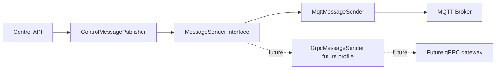

# GCS-Saker M8 MessageSender Abstraction

## 목적

백엔드 application/controller 코드가 MQTT, gRPC, HTTP client 같은 통신 라이브러리를 직접 호출하지 않도록 `MessageSender` interface를 둔다. transport 구현체는 runtime 설정으로 선택하고, control command 생성 규칙은 `ControlMessagePublisher`에 모은다.

## 현재 구조

## 적용 원칙

- controller는 `mqtt.client`를 import하지 않는다.
- controller는 `ControlMessagePublisher`만 의존한다.
- payload 생성은 command type과 payload format에 따라 publisher가 담당한다.
- transport 전송은 `MessageSender.send()`만 호출한다.
- default sender는 `CONTROL_MESSAGE_SENDER=mqtt`다.
- `CONTROL_MESSAGE_SENDER=grpc`는 후속 runtime 구현 전까지 명확한 unavailable 상태로 격리한다.

## 왜 이렇게 하나

기존 구조에서는 control API가 MQTT publish helper를 직접 호출했다. 이 상태에서 gRPC를 도입하면 API 코드, 테스트, 오류 처리, payload 생성 경로가 동시에 바뀐다. interface를 두면 변경 범위가 구현체로 제한된다.

## 후속 구현

1. `GrpcMessageSender` runtime client를 붙인다.
2. gRPC sender에도 같은 `MessageEnvelope` 입력을 사용한다.
3. MQTT/gRPC dual-write canary를 별도 sender 구현체로 검증한다.
4. 실패율, publish latency, retry count를 sender별 metric으로 분리한다.
5. Kotlin/Go service에도 같은 형태의 port/interface를 둔다.
