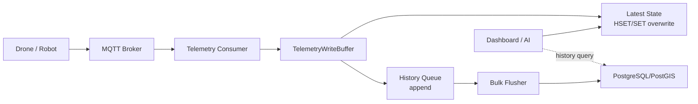

# GCS-Saker M8 Telemetry Write Buffer Strategy

## 목적

드론/로봇 telemetry는 수신 즉시 PostgreSQL에 한 건씩 쓰면 안 된다. 실시간 조회와 영구 저장은 성격이 다르므로, latest state와 history queue를 분리하고 PostgreSQL/PostGIS에는 batch 또는 COPY 계열 bulk flush로 적재한다.

## 목표 흐름

## 쓰기 전략

- latest state는 `org/group/asset/stream` key 기준으로 덮어쓴다.
- history는 queue/list/stream에 append한다.
- flush worker는 N초 또는 N건 기준으로 batch를 꺼낸다.
- PostgreSQL에는 multi-row insert보다 가능하면 COPY protocol을 우선 검토한다.
- flush 실패 시 drain한 batch는 유실하지 않고 queue 앞쪽에 복원한다.

## PostgreSQL 읽기 전략

- dashboard 최신 위치는 raw history를 보지 않는다.
- 실시간 화면은 latest state 또는 latest read model table을 본다.
- 무거운 join과 집계는 materialized view 또는 rollup table로 분리한다.
- 일반 VIEW는 호출 때마다 원본 쿼리를 다시 실행하므로 캐시 전략으로 보지 않는다.

## 데이터 경량화 기준

- status, health, asset kind는 string 대신 enum/smallint 후보를 둔다.
- timestamp는 text가 아니라 integer epoch 또는 timestamptz를 사용한다.
- raw payload는 장기 저장 table에 그대로 넣지 않는다.
- high-cardinality tag는 index 남발을 피한다.

## 현재 PR의 범위

이번 단계는 runtime 완성보다 port/interface 계약을 먼저 고정한다.

- `TelemetryWriteBuffer`: latest overwrite와 history queue를 추상화한다.
- `BufferedTelemetrySink`: MQTT telemetry를 buffer에 넣고 threshold 기준 flush를 호출한다.
- `TelemetryBulkSink`: PostgreSQL/PostGIS bulk adapter가 들어올 자리다.
- `InMemoryTelemetryWriteBuffer`: 단위/통합 테스트용 구현체다.
- `RedisTelemetryWriteBuffer`: Redis/Dragonfly 호환 list queue 구현체다. history는 `RPUSH`/`LPOP`으로 FIFO drain하고, flush 실패 시 `LPUSH`로 앞쪽에 복원한다.
- Redis/Dragonfly 구현은 backlog 판단에 `LLEN`만 사용한다. 운영 중 `KEYS *`처럼 전체 keyspace를 막는 명령은 사용하지 않는다.

후속 단계에서 실제 운영 Redis client wiring과 PostGIS COPY 기반 `TelemetryBulkSink`를 추가한다.
