# GCS-Saker 서버 기술 입문 가이드 v0.1

이 문서는 GCS-Saker 서버에 적용된 주요 기술과 개발 원칙을 코딩 초보자가 그림으로 따라가며 공부할 수 있도록 정리한 자료다. 목표는 단순한 기술 이름 암기가 아니라, “왜 이 기술이 여기 필요한가”, “서버 안에서 어디에 배치되는가”, “코드를 짤 때 어떤 습관으로 이어지는가”를 이해하는 것이다.

## 1. 한 문장으로 보는 GCS-Saker

GCS-Saker는 휴대폰, 드론, 로봇 같은 현장 장비가 보내는 영상, 음성, 위치, 상태 데이터를 낮은 지연으로 받아서 대시보드에서 보고, 인증/권한/운영 상태/장애 대응까지 함께 관리하는 실시간 관제 시스템이다.

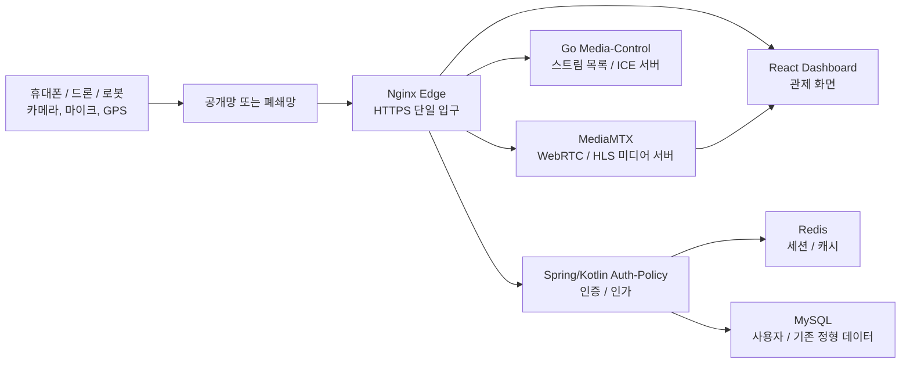

핵심 판단:

- 외부에서 직접 접속 가능한 곳은 Nginx Edge 하나로 제한한다.
- 영상/음성 패킷은 Python/Spring 서버를 통과시키지 않고 MediaMTX와 WebRTC 경로로 흘린다.
- 인증/인가, 스트림 목록, 운영 상태는 별도 API 서버가 담당한다.
- 폐쇄망에서도 돌아갈 수 있도록 STUN/TURN, 지도, 시간 동기화, 배포 방식을 계속 분리한다.

## 2. 서버에 올라간 주요 기술 전체 지도

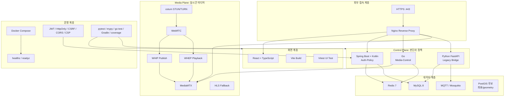

## 3. 각 기술이 맡는 역할

| 기술 | 초보자용 비유 | 이 서버에서 하는 일 |
| --- | --- | --- |
| Nginx | 건물 1층 안내 데스크 | 외부 요청을 dashboard, auth, media-control, MediaMTX로 라우팅한다. |
| Docker Compose | 여러 기계를 한 번에 켜는 전원 스위치 | MySQL, Redis, MediaMTX, coturn, auth-policy, dashboard 등을 함께 실행한다. |
| React + TypeScript | 관제사가 보는 조종석 | 지도, 스트림 플레이어, 자산 트리, 서버 상태, 이벤트 로그를 보여준다. |
| Vite | 프론트 빌드 공장 | React 코드를 브라우저가 읽을 수 있는 정적 파일로 묶는다. |
| Spring Boot + Kotlin | 엄격한 출입 관리 시스템 | 로그인, 세션, 권한, 그룹 정책, 시간 동기화 같은 정책을 맡는다. |
| Go media-control | 빠른 스트림 안내원 | 스트림 목록, 재생 URL, ICE 서버 목록, MediaMTX 상태 조회를 맡는다. |
| Python FastAPI | 기존 기능을 이어주는 다리 | 기존 API와 DB 구조를 유지하면서 점진 이전을 돕는다. |
| MediaMTX | 영상/음성 중계소 | WebRTC WHIP/WHEP, HLS, RTSP/RTMP/SRT 같은 미디어 입출력을 처리한다. |
| WebRTC | 브라우저 실시간 통화 기술 | 휴대폰 카메라와 대시보드 사이에 낮은 지연 영상/음성을 연결한다. |
| WHIP | 송출용 WebRTC 약속 | publisher가 MediaMTX에 “내 영상을 보낼게”라고 offer를 보낸다. |
| WHEP | 수신용 WebRTC 약속 | viewer가 MediaMTX에 “그 영상을 볼게”라고 offer를 보낸다. |
| STUN | 내 공인 주소를 알아보는 거울 | NAT 뒤에 있는 장비가 외부에서 보이는 주소 후보를 찾게 돕는다. |
| TURN | 직접 연결이 안 될 때 쓰는 우회 터널 | 방화벽/NAT 때문에 직접 WebRTC가 안 될 때 미디어를 relay한다. |
| Redis | 아주 빠른 메모장 | refresh session, stream presence, 최신 상태, 짧은 TTL 캐시를 저장한다. |
| MySQL | 장부 | 사용자, 회사, 기존 정형 데이터를 안정적으로 저장한다. |
| MQTT | 장비 메시지 버스 | 장비 이벤트와 제어 메시지를 가볍게 주고받기 위한 후보 경로다. |
| HLS | 느리지만 호환성 좋은 영상 보기 | WebRTC 실패 시 fallback 재생 경로로 둔다. |
| pytest / Vitest / go test / Gradle | 자동 검산기 | 코드를 바꿔도 기존 기능이 깨지지 않는지 확인한다. |

## 4. Control Plane과 Media Plane

실시간 스트리밍 시스템에서 가장 중요한 구분이다.

- Control Plane: 누가 볼 수 있는가, 어떤 스트림이 있는가, 서버 상태는 어떤가를 판단한다.
- Media Plane: 실제 영상/음성 패킷이 지나간다.

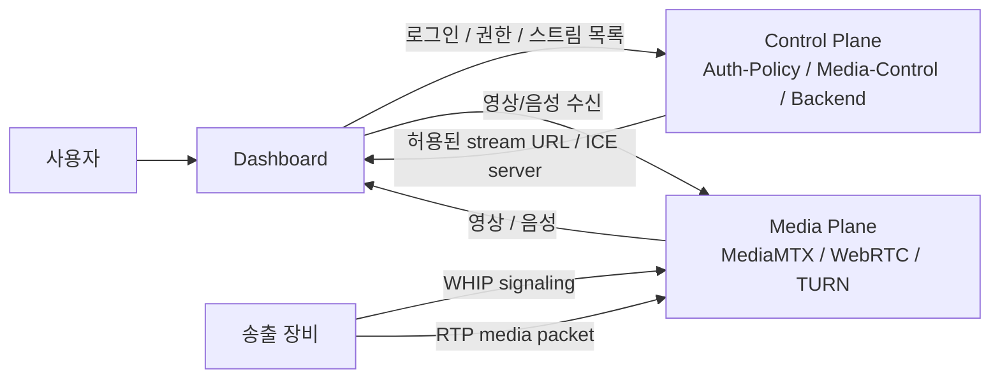

왜 이렇게 나누는가:

- Python/Spring/Go API 서버가 미디어 패킷을 직접 들고 있으면 지연이 커진다.
- 권한 판단은 엄격해야 하지만, 영상 패킷 전달은 빠르게 흘러야 한다.
- 장애가 나도 어느 계층 문제인지 나눠 볼 수 있다.

## 5. WebRTC를 그림으로 이해하기

WebRTC는 브라우저와 브라우저 또는 브라우저와 미디어 서버가 실시간으로 영상/음성을 주고받기 위한 기술이다. 하지만 “그냥 URL을 열면 영상이 나온다”가 아니다. 먼저 signaling을 하고, ICE 후보를 교환하고, media path가 연결되어야 한다.

### 5.1 송출 흐름: WHIP

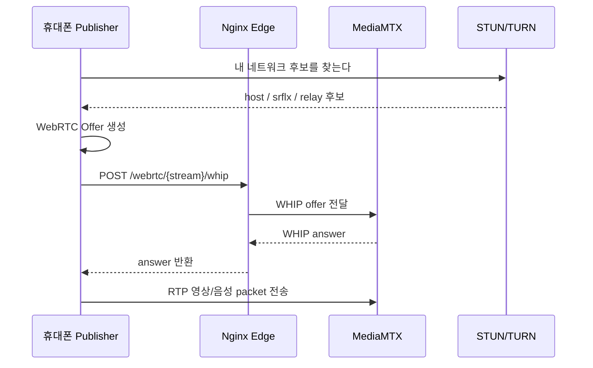

### 5.2 수신 흐름: WHEP

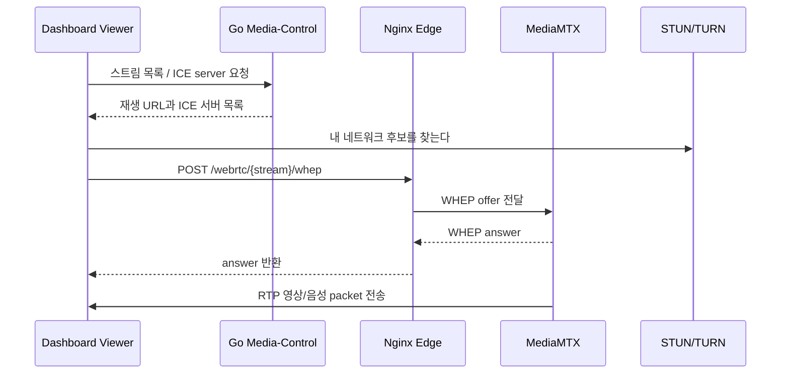

### 5.3 STUN과 TURN 차이

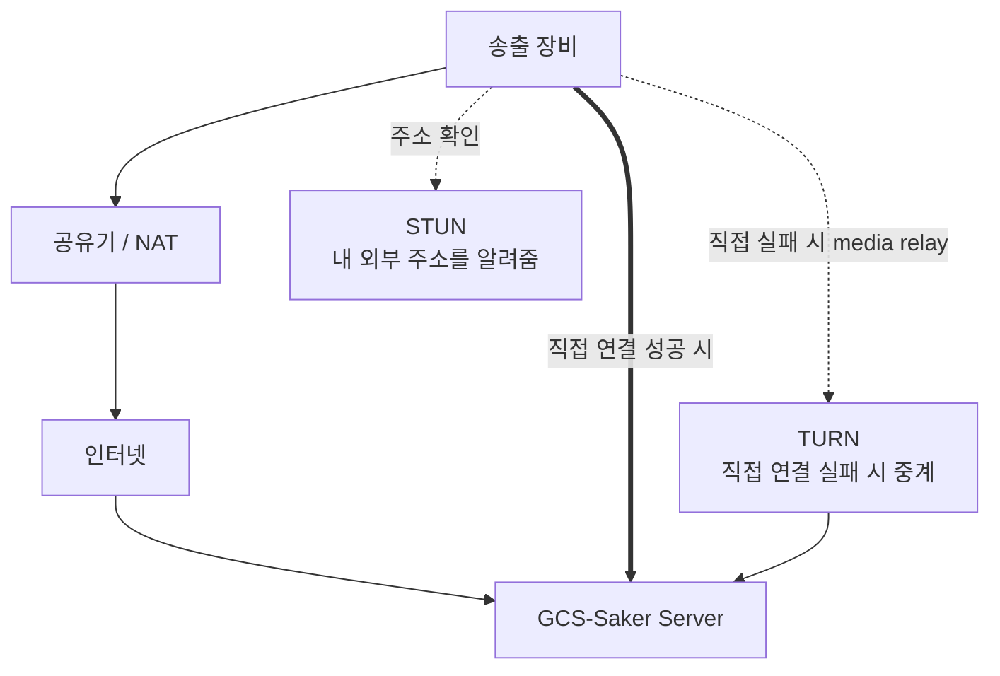

초보자 관점:

- STUN은 “내가 밖에서 어떤 주소로 보이는지 알려주는 거울”이다.
- TURN은 “직접 못 가면 대신 전달해주는 중계 택배”다.
- TURN은 안정적이지만 서버 트래픽과 비용을 더 쓴다.
- 폐쇄망에서는 외부 Google STUN이 안 되므로 자체 STUN/TURN이 필요하다.

## 6. 왜 MediaMTX를 쓰는가

MediaMTX는 미디어 서버다. 직접 WebRTC signaling과 미디어 처리를 처음부터 만들면 복잡하고 위험하다. 이미 검증된 미디어 서버를 사용하면 우리 코드는 관제, 권한, UI, 운영 안정성에 집중할 수 있다.

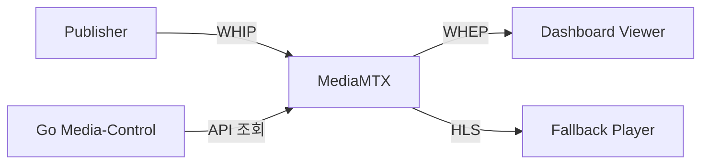

장점:

- WebRTC, HLS, RTSP/RTMP/SRT 같은 미디어 프로토콜을 한 곳에서 처리한다.
- 앱 서버가 미디어 패킷을 직접 처리하지 않아 지연과 CPU 부담이 줄어든다.
- HLS fallback 경로를 함께 둘 수 있다.

주의:

- SDP candidate에 private IP가 섞이면 외부 NAT 환경에서 문제가 날 수 있다.
- TURN relay range, MediaMTX advertised host, Nginx proxy 설정이 같이 맞아야 한다.

## 7. 인증/인가와 JWT 세션

인증은 “누구인가”, 인가는 “무엇을 할 수 있는가”다.

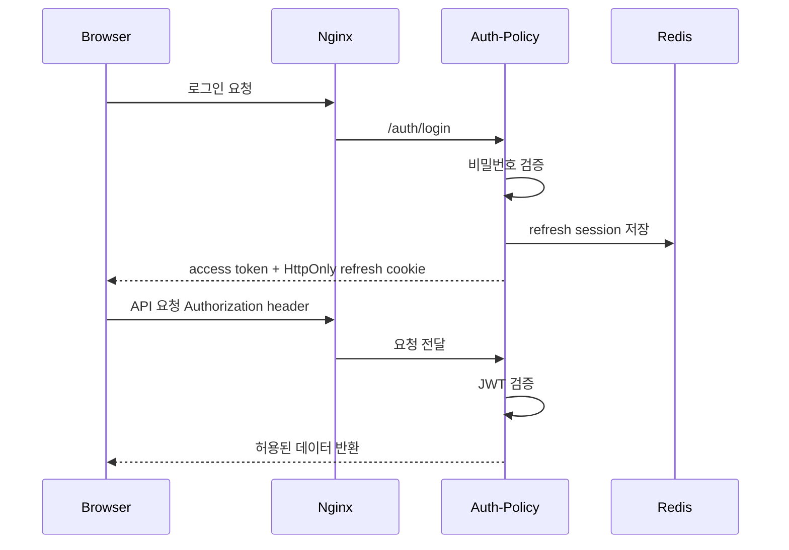

현재 방향:

- access token은 짧게 가져간다.
- refresh token은 HttpOnly cookie로 관리한다.
- Redis를 refresh session 저장소로 사용한다.
- CSRF custom header, Origin/Referer, CORS allowlist, HTTPS를 함께 본다.

초보자 포인트:

- JWT는 “서버가 서명한 출입증”이다.
- HttpOnly cookie는 JavaScript가 직접 읽을 수 없는 쿠키다.
- XSS가 생겨도 토큰 탈취 위험을 줄일 수 있다.
- CSRF는 “사용자가 모르게 브라우저가 요청을 보내는 공격”이다.

## 8. Nginx Reverse Proxy

외부에서는 `https://a4ai.tplinkdns.com/` 하나로 들어오지만, 내부에는 여러 서비스가 있다. Nginx는 경로를 보고 올바른 서비스로 요청을 보낸다.

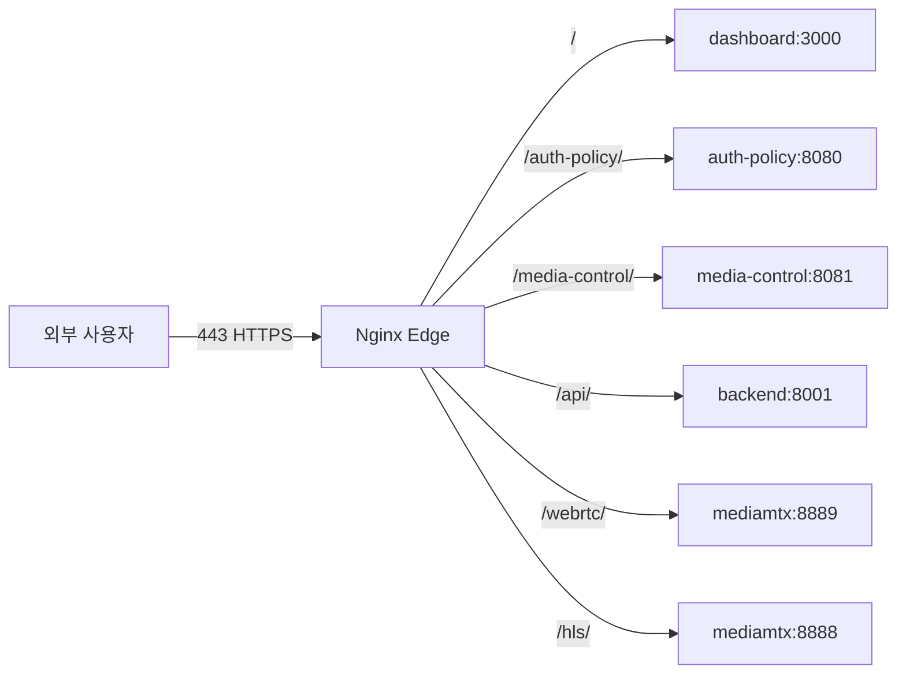

좋아지는 점:

- `3000`, `8001`, `8888`, `8889`를 외부에 직접 열지 않아도 된다.
- HTTPS, CSP, HSTS 같은 보안 헤더를 한 곳에서 관리한다.
- 서버 구조가 바뀌어도 외부 URL은 덜 흔들린다.

## 9. Docker Compose와 서비스 구동 순서

Docker Compose는 여러 컨테이너를 한 번에 관리한다. 이 서버에서는 다음 순서가 중요하다.

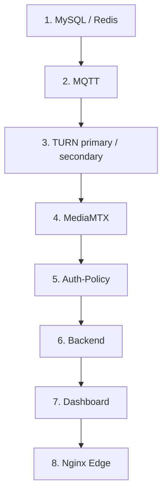

왜 순서가 필요한가:

- API 서버는 DB와 Redis가 떠 있어야 정상 동작한다.
- media-control은 MediaMTX와 TURN 상태를 읽어야 한다.
- edge는 뒤 서비스들이 준비되어야 정상 라우팅한다.

## 10. 데이터 저장소: MySQL, Redis, PostGIS 후보

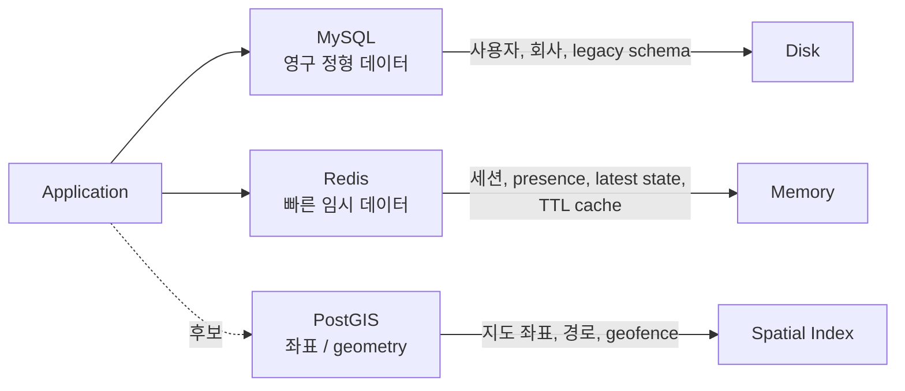

구분:

- MySQL: 사라지면 안 되는 정형 데이터.
- Redis: 빠르게 읽고, 일정 시간이 지나면 사라져도 되는 데이터.
- PostGIS 후보: 좌표, 경로, 영역 검색이 많아질 때 유리하다.

초보자 포인트:

- DB 튜닝의 핵심은 디스크 I/O를 줄이는 것이다.
- Redis는 빠르지만 영구 저장소로만 믿으면 안 된다.
- 좌표 검색은 일반 DB보다 공간 인덱스가 있는 DB가 유리하다.

## 11. 지도와 시간 동기화

관제 시스템에서는 위치와 시간이 중요하다. 영상, 음성, GPS, AI overlay가 같은 상황을 가리키려면 timestamp가 맞아야 한다.

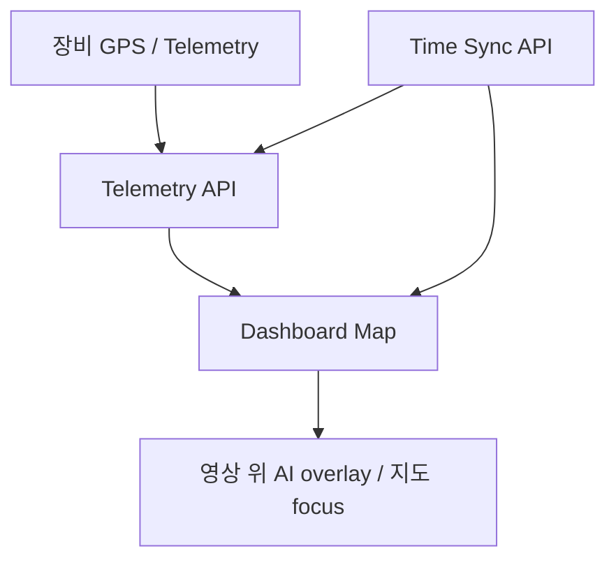

현재 방향:

- 공개망에서는 외부 지도 타일을 사용할 수 있다.
- 폐쇄망 납품을 위해 외부 API에 의존하지 않는 지도 옵션이 필요하다.
- 시간 서버는 공개망/폐쇄망 모드를 나눠 설정한다.
- 폐쇄망에서는 내부 NTP 또는 지정 IP/도메인을 보도록 한다.

## 12. 프론트엔드 구조

프론트는 TypeScript를 사용한다. TypeScript는 JavaScript에 타입을 추가해서 런타임 오류를 줄인다.

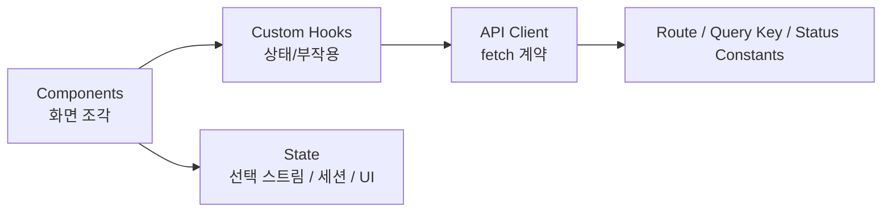

현재 적용 방향:

- 스트림 재생은 `RealtimePlayer`, `WebRTCPlayer`, `HLSFallbackPlayer`처럼 역할을 분리한다.
- WebRTC 연결 로직은 custom hook으로 분리한다.
- API route, status, query key 같은 문자열은 상수화한다.
- 영상 위에 불필요한 UI가 겹치지 않도록 플레이어 표시를 최소화한다.

초보자 포인트:

- component는 화면을 그리는 역할이다.
- hook은 상태와 비동기 동작을 관리하는 역할이다.
- 한 컴포넌트에 `useState`가 너무 많으면 관리가 어려워진다.
- 불필요한 `useEffect`는 렌더링과 메모리 누수 문제를 만들 수 있다.

## 13. 테스트 체계

테스트는 “코드가 돌아간다”를 사람 기억이 아니라 자동 검증으로 고정하는 장치다.

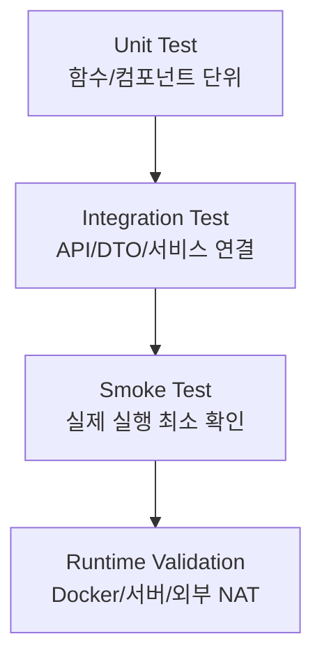

사용 중인 테스트:

- React/TypeScript: Vitest, Testing Library, coverage.
- Python/FastAPI: pytest, coverage, mypy.
- Go: go test, coverage.
- Kotlin/Spring: Gradle test, Jacoco.
- Docker: compose config, healthcheck.
- WebRTC: WHIP/WHEP smoke, TURN relay smoke, first frame latency.

초보자 포인트:

- Unit test는 작은 부품 검증이다.
- Integration test는 부품끼리 붙였을 때 검증이다.
- Smoke test는 실제 실행 가능 여부를 빠르게 확인한다.
- 운영 시스템은 “빌드 성공”보다 “실제로 접속/송출/수신 가능”이 중요하다.

## 14. SOLID 원칙 입문

SOLID는 객체지향 설계를 단단하게 만드는 다섯 가지 원칙이다. 처음에는 이름보다 “왜 필요한가”를 이해하는 것이 중요하다.

### 14.1 SRP: Single Responsibility Principle

하나의 클래스/함수는 하나의 책임만 가져야 한다.

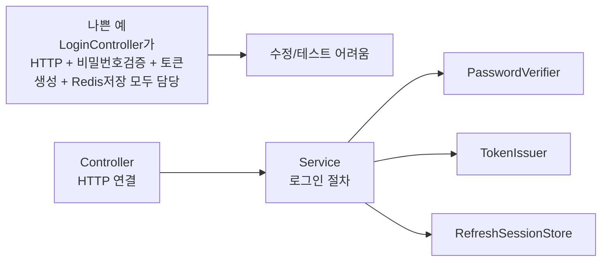

GCS-Saker 적용:

- Controller는 HTTP 연결과 orchestration만 담당하도록 줄인다.
- DTO, route contract, domain object를 분리한다.
- WebRTC 연결 로직은 React component가 아니라 hook 쪽으로 분리한다.

### 14.2 OCP: Open/Closed Principle

기능 확장에는 열려 있고, 기존 코드 수정에는 닫혀 있어야 한다.

초보자 비유:

- 멀티탭에 새 기기를 꽂는 것은 쉽다.
- 벽 안의 전선을 매번 뜯어 고치면 위험하다.

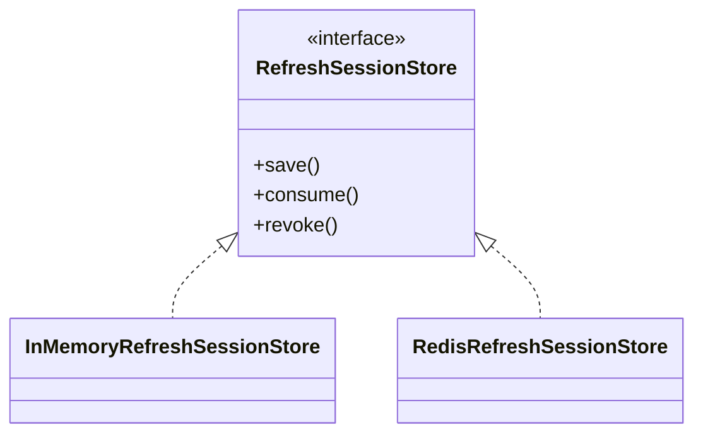

GCS-Saker 적용:

- `RefreshSessionStore` 같은 인터페이스를 바라보게 하면, 인메모리 구현에서 Redis 구현으로 바꿔도 호출부를 크게 바꾸지 않는다.
- media-control이 MediaMTX API를 직접 온 코드에 흩뿌리지 않고 adapter를 두면, 나중에 다른 미디어 서버로 바꿀 때 변경 범위가 작다.
- 지도 provider를 설정으로 바꾸면 공개망 지도와 폐쇄망 지도를 교체하기 쉽다.

### 14.3 LSP: Liskov Substitution Principle

부모 타입이 기대되는 곳에 자식 타입을 넣어도 동작이 깨지면 안 된다.

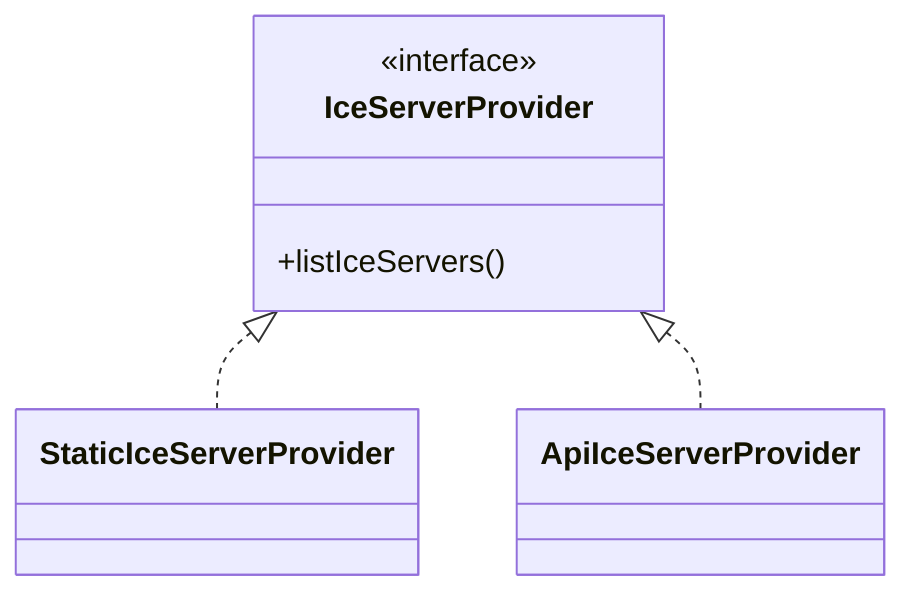

좋은 예:

- `IceServerProvider`를 쓰는 코드는 정적 provider인지 API provider인지 몰라도 된다.
- 둘 다 같은 형태의 ICE server list를 반환해야 한다.

### 14.4 ISP: Interface Segregation Principle

너무 큰 인터페이스 하나보다 작은 인터페이스 여러 개가 낫다.

나쁜 예:

```text
MediaService = 스트림목록 + 권한확인 + TURN관리 + MediaMTX제어 + 로그조회
```

좋은 예:

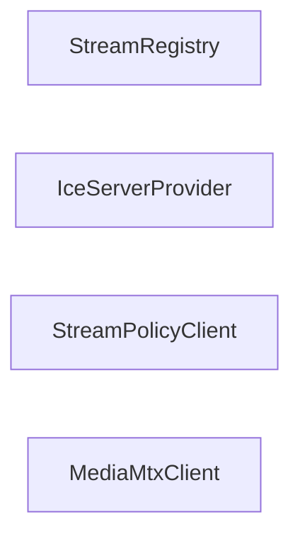

효과:

- 테스트할 때 필요한 부분만 mock할 수 있다.
- 권한 정책과 미디어 서버 제어가 섞이지 않는다.

### 14.5 DIP: Dependency Inversion Principle

상위 정책은 구체 구현이 아니라 추상화에 의존해야 한다.

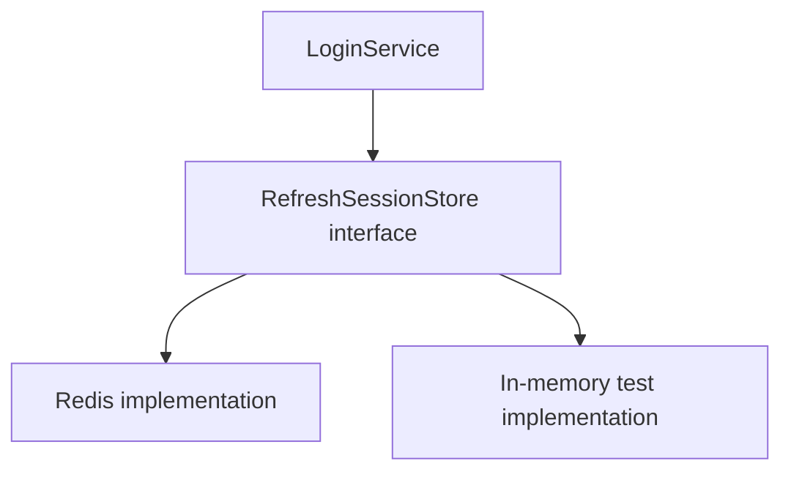

GCS-Saker 적용:

- Service는 Redis 명령어 자체보다 store interface를 바라본다.
- 테스트에서는 in-memory 구현으로 빠르게 검증하고, 운영에서는 Redis 구현을 사용한다.

## 15. 객체지향 4대 원칙

| 원칙 | 쉬운 설명 | GCS-Saker 예 |
| --- | --- | --- |
| 캡슐화 | 내부를 숨기고 필요한 기능만 공개 | refresh token 저장 구조를 호출부가 직접 만지지 않는다. |
| 상속 | 공통 성질을 부모로 묶는다 | 공통 provider/interface를 만들고 구현체를 갈아 끼운다. |
| 다형성 | 같은 요청에 구현체마다 다르게 반응 | Redis store와 in-memory store를 같은 interface로 사용한다. |
| 추상화 | 복잡한 내부를 단순한 이름으로 다룬다 | `IceServerList`, `AllowedOrigins`, `StreamRoutePolicy` 같은 도메인 이름을 쓴다. |

## 16. 불변 객체와 일급 컬렉션

불변 객체는 만든 뒤 값이 바뀌지 않는 객체다. 일급 컬렉션은 `List<String>` 같은 원시 컬렉션을 의미 있는 객체로 감싼 것이다.

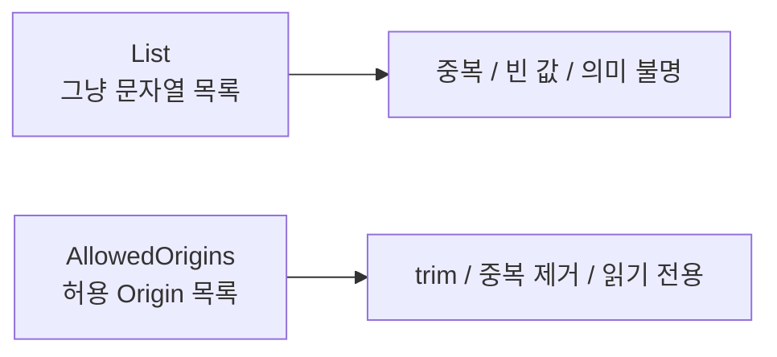

좋아지는 점:

- 잘못된 값이 생성 시점에 걸린다.
- 함수 인자만 봐도 의미가 드러난다.
- 동시성 상황에서 값이 몰래 바뀌는 위험이 줄어든다.

## 17. DTO, VO, Domain Model

초보자가 자주 헷갈리는 부분이다.

| 이름 | 역할 | 예 |
| --- | --- | --- |
| DTO | 외부와 주고받는 JSON 계약 | `LoginRequest`, `TokenResponse`, `StreamResponse` |
| VO | 값 자체가 의미인 객체 | `GroupId`, `StreamPath`, `Coordinate` |
| Domain Model | 내부 규칙과 행동을 가진 모델 | `AuthUser`, `StreamSession`, `StreamRoutePolicy` |

```mermaid
flowchart LR
    Json["HTTP JSON"] --> DTO["DTO"]
    DTO --> Mapper["Mapper / Factory"]
    Mapper --> Domain["Domain Model / VO"]
    Domain --> Service["Service Logic"]
```

원칙:

- 컨트롤러에서 DB 모델을 바로 반환하지 않는다.
- DTO field 이름은 contract로 고정한다.
- domain object는 생성 시점에 검증한다.

## 18. 적용된 디자인 패턴

| 패턴 | 쉬운 설명 | GCS-Saker 적용 |
| --- | --- | --- |
| Proxy | 대신 받아서 전달 | Nginx reverse proxy가 외부 요청을 내부 서비스로 보낸다. |
| Adapter | 다른 모양의 API를 우리 모양으로 변환 | MediaMTX client, TURN registry, auth-policy client |
| Strategy | 상황에 따라 전략 교체 | 저지연 오디오 모드 / 음질 모드, 지도 provider |
| Repository | 저장소 접근을 숨김 | 사용자, 세션, stream registry 저장 방식 분리 |
| Factory Method | 생성 규칙을 한곳에 둠 | route policy, allowed origins, invite, ICE server list 후보 |
| Facade | 복잡한 내부를 단순 API로 감쌈 | media-control이 stream list/playback/ICE 정보를 단순 endpoint로 제공 |
| Observer | 상태 변화를 감지 | React hook이 WebRTC state, audio activity, stats 변화를 감시 |
| Dependency Injection | 필요한 구현체를 외부에서 주입 | Spring bean, test mock, Go interface |

## 19. WebRTC 오디오 지연 진단

최근 #290에서 추가한 관점이다. 오디오가 늦으면 단순히 “소리가 안 좋다”가 아니라 여러 원인을 분리해서 봐야 한다.

```mermaid
flowchart TB
    Delay["오디오 지연 체감"] --> Browser["브라우저 마이크 후처리<br/>echo/noise/AGC"]
    Delay --> Network["네트워크 packet loss / jitter"]
    Delay --> TURN["TURN relay 경로"]
    Delay --> Buffer["브라우저 jitter buffer 증가"]
    Delay --> Codec["Opus encode/decode"]
```

추가된 계측:

- audio jitter
- jitter buffer delay
- packets lost / received
- concealed samples
- selected ICE candidate type
- transport protocol
- round trip time

운영 판단:

- packet loss가 크면 네트워크/TURN/무선 품질을 본다.
- jitter buffer가 커지면 브라우저가 끊김을 숨기기 위해 일부러 늦게 재생할 수 있다.
- local candidate가 relay면 TURN 서버 트래픽과 지연을 함께 본다.

## 20. 보안 기술 묶음

```mermaid
flowchart TB
    HTTPS["HTTPS / TLS"] --> Cookie["HttpOnly Refresh Cookie"]
    Cookie --> JWT["JWT Access Token"]
    JWT --> CSRF["CSRF Header + Origin Check"]
    CSRF --> CORS["CORS Allowlist"]
    CORS --> CSP["CSP / X-Frame-Options / HSTS"]
```

각 기술:

- HTTPS: 요청/응답 암호화.
- JWT: 서명된 인증 토큰.
- HttpOnly Cookie: JavaScript가 직접 읽지 못하게 하는 쿠키.
- CSRF 방어: 사용자가 모르게 요청이 나가는 공격 방지.
- CORS: 허용된 출처에서만 API 호출 허용.
- CSP: XSS 피해 범위를 줄이는 브라우저 보안 정책.
- HSTS: 브라우저가 HTTPS를 강제하도록 유도.

중요한 습관:

- 비밀번호와 token은 GitHub, PR, issue, 문서에 쓰지 않는다.
- `.env`는 환경별로 분리한다.
- secret은 예제 파일에는 가짜 값만 둔다.

## 21. 운영 안정성

운영 시스템은 “평소에 잘 됨”보다 “문제가 생겼을 때 어떻게 버티는가”가 중요하다.

```mermaid
flowchart LR
    Health["healthz<br/>살아있나"] --> Ready["readyz<br/>요청 받아도 되나"]
    Ready --> Restart["restart: unless-stopped"]
    Restart --> Logs["logs / event log"]
    Logs --> Runbook["장애 대응 Runbook"]
```

현재 적용/방향:

- Docker healthcheck로 컨테이너 상태를 확인한다.
- edge, dashboard, auth-policy, backend, redis, mysql 상태를 분리해서 본다.
- 스트림 끊김은 UI에서 감지하고 재연결 상태를 표시한다.
- TURN/MediaMTX 장애는 degraded behavior 테스트 대상으로 관리한다.

## 22. 초보자 공부 순서

처음부터 전부 이해하려고 하면 어렵다. 아래 순서로 보면 좋다.

1. HTTP와 HTTPS
   - 브라우저가 서버에 요청하고 응답받는 기본 구조.
2. Docker Compose
   - 여러 서비스를 한 번에 띄우는 방식.
3. Nginx reverse proxy
   - 하나의 도메인이 여러 내부 서비스로 나뉘는 방식.
4. React component와 hook
   - 화면과 상태 관리.
5. JWT, cookie, session
   - 로그인 유지와 보안.
6. WebRTC 기본
   - offer/answer, ICE, STUN, TURN.
7. MediaMTX WHIP/WHEP
   - 송출/수신 signaling.
8. Redis와 MySQL 차이
   - 메모리 캐시와 영구 저장소.
9. 테스트
   - unit, integration, smoke, coverage.
10. SOLID와 디자인 패턴
   - 코드를 오래 유지하기 위한 설계 습관.

## 23. 초보자를 위한 핵심 문장 모음

- WebRTC는 실시간 영상 통화의 기술이고, WHIP/WHEP은 미디어 서버와 WebRTC를 연결하는 약속이다.
- STUN은 주소를 찾고, TURN은 직접 연결이 안 될 때 대신 전달한다.
- Nginx는 외부 입구를 하나로 만들고 내부 서비스를 숨긴다.
- Docker Compose는 여러 서버 프로그램을 한 묶음으로 실행한다.
- Redis는 빠른 임시 저장소이고, MySQL은 오래 보관할 정형 데이터 저장소다.
- DTO는 외부 계약이고, Domain Model은 내부 규칙이다.
- OCP는 새 기능을 추가할 때 기존 코드를 덜 고치게 만드는 원칙이다.
- 테스트는 내가 방금 본 화면이 아니라, 다음 사람이 고쳐도 계속 맞는지 지켜주는 안전망이다.

## 24. 앞으로 더 공부하며 봐야 할 문서

- `docs/architecture/GCS-Saker_Effective_Engineering_Notes_v0.1.md`
- `docs/architecture/GCS-Saker_M7_single_node_architecture_poc.md`
- `docs/architecture/GCS-Saker_M7_media_control_cutover.md`
- `docs/operations/GCS-Saker_M7_external_nat_webrtc_validation.md`
- `docs/operations/GCS-Saker_TURN_기본_구축_가이드_v0.1.md`
- `docs/security/GCS-Saker_인증세션_보안정책_v0.1.md`

## 25. 한 장 요약

```mermaid
mindmap
  root((GCS-Saker))
    실시간 스트리밍
      WebRTC
      WHIP
      WHEP
      STUN
      TURN
      MediaMTX
      HLS fallback
    서버 구조
      Nginx Edge
      Docker Compose
      Control Plane
      Media Plane
    백엔드
      Spring Kotlin Auth
      Go Media Control
      Python Legacy Bridge
    데이터
      MySQL
      Redis
      MQTT
      PostGIS 후보
    보안
      JWT
      HttpOnly Cookie
      CSRF
      CORS
      CSP
      HTTPS
    설계 원칙
      SRP
      OCP
      LSP
      ISP
      DIP
      DTO
      VO
      불변 객체
      일급 컬렉션
    테스트
      Unit
      Integration
      Smoke
      Coverage
      Runtime Validation
```
