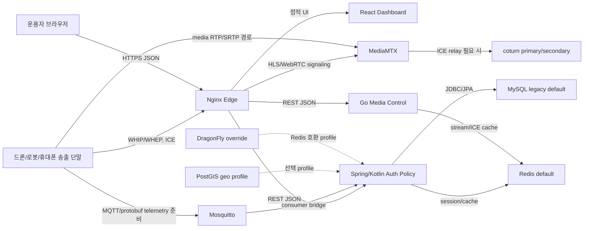

# GCS-Saker 설계 반영도 감사 보고서

작성일: 2026-06-19  
범위: 로컬 저장소 `gcs-saker-arch-poc`, M7 런타임 전환 및 M8 프로토콜/스택 전환 준비 상태

## 1. 결론

현재 코드는 "문서화된 설계 방향"의 상당 부분을 반영하고 있다. 특히 프론트엔드 계약 상수화, Spring/Kotlin 인증 정책 서버, Go media-control, protobuf 계약, Redis 기반 세션/캐시, MediaMTX/coturn 중심 스트리밍 구조는 실제 코드와 테스트로 확인된다.

이번 감사 이후 `deploy/compose/compose.single-node.poc.yml`의 기본 실행값은 Spring/Kotlin `auth-policy`와 Go `media-control`을 active runtime으로 포함하도록 수정되었다. 따라서 "Spring/Go가 기본 런타임"이라는 설계 의도는 Compose 모델에도 반영되었다. 다만 gRPC, DragonFly, PostGIS, WebCodecs는 아직 active runtime 완료가 아니라 contract, profile, prototype 단계로 구분해야 한다.

이 구분은 이제 사람이 읽는 문서에만 남기지 않고 `docs/architecture/GCS-Saker_runtime_stack_status.yml`에 기계 판독 가능한 계약으로 고정했다. 해당 계약은 active/profile/contract/prototype/deferred 상태를 사용하며, `backend/tests/test_runtime_stack_status_contract.py`가 active runtime 서비스와 Nginx route, 미완료 항목의 상태를 검증한다.

## 2. 눈으로 보는 현재 반영도



### 반영도 요약

| 영역 | 목표 설계 | 현재 반영도 | 판단 |
| --- | --- | ---: | --- |
| 레이어 분리 | 프론트, 인증 정책, 미디어 제어, 미디어 서버, DB/캐시 분리 | 85% | 구조는 분리됨. Spring/Go 기본 Compose 반영 완료 |
| Active runtime 전환 | Python backend를 active blocker에서 제외하고 Spring/Go 중심 | 80% | Nginx route와 Compose 기본값이 Spring/Go를 봄. Python fallback은 아직 남음 |
| DTO/계약 상수화 | endpoint/header/error/DTO field 중앙 관리 | 85% | Spring/TS/Go에 반영. 일부 legacy Python은 잔존 |
| Protobuf | 내부/device/native gateway용 계약 | 65% | `.proto`와 언어별 codec 있음. 전체 runtime gRPC는 아직 아님 |
| gRPC | 내부 bidirectional streaming runtime | 25% | 문서/이슈/추상화 단계. 실제 active runtime 연결은 미완 |
| MQTT | telemetry/control 흡수 계층 | 60% | Mosquitto와 consumer bridge 있음. 기본 no-auth는 운영 기본값으로 부적절 |
| DB | MySQL legacy default, PostGIS geo profile, Redis session/cache | 75% | 실제 persistence와 Redis 반영. PostgreSQL/PostGIS는 선택 profile |
| DragonFly | Redis 대체 가능성 검증 | 40% | override와 정적 계약 있음. 운영 대체 검증은 미완 |
| WebRTC | MediaMTX/coturn, STUN/TURN, ICE 관측 | 80% | 핵심 경로 존재. TURN 부담/ICE 실패 계측 고도화는 계속 필요 |
| 폐쇄망 | 외부 의존 최소화, 자체 TURN/STUN, 오프라인 납품 준비 | 65% | 방향은 반영. 지도/패키지/인증서/이미지 번들링 검증은 추가 필요 |
| 테스트 | unit + integration + contract + runtime smoke | 80% | 언어별 테스트 통과. Compose 기본 실행 회귀 테스트 추가 |
| 운영/관측 | health, ready, event, server status, log | 70% | 기능은 있음. 장애 재시작/장애 주입 검증은 더 필요 |

## 3. 코드 증거

### 3.1 프론트엔드

확인 파일:

- `gcs-dashboard/src/features/apiRoutes.ts`
- `gcs-dashboard/src/features/stateContracts.ts`
- `gcs-dashboard/src/features/auth/authStorage.ts`
- `gcs-dashboard/src/features/streaming/iceServers.ts`
- `gcs-dashboard/src/features/dashboard/*`

좋은 점:

- API route, query key, status enum 계열을 상수/readonly 객체로 묶는 방향이 반영되어 있다.
- 인증 토큰 저장 책임이 `authStorage`로 분리되어 있고, 테스트가 있다.
- streaming, time sync, map, dashboard presentation, operational events가 기능별 파일로 분리되어 있다.
- 전체 프론트 테스트가 통과했다.

검증 결과:

- `npm test -- --run`
- 결과: 37 files passed, 212 tests passed
- `npm run build`
- 결과: 성공

남은 문제:

- UI/UX 변경 속도가 빨라 파일 크기와 스타일 분산이 다시 커질 수 있다.
- 실제 브라우저에서 WebRTC media frame, audio waveform, reconnect UX를 자동 검증하는 Playwright 수준 테스트가 아직 충분하지 않다.

### 3.2 Spring/Kotlin auth-policy

확인 파일:

- `services/auth-policy/src/main/kotlin/kr/co/a4ai/gcssaker/authpolicy/api/*`
- `services/auth-policy/src/main/kotlin/kr/co/a4ai/gcssaker/authpolicy/domain/*`
- `services/auth-policy/src/main/kotlin/kr/co/a4ai/gcssaker/authpolicy/infrastructure/*`
- `services/auth-policy/src/main/kotlin/kr/co/a4ai/gcssaker/authpolicy/protocol/v2/*`

좋은 점:

- `api`, `application`, `domain`, `infrastructure`, `protocol` 계층이 구분되어 있다.
- Auth, Health, Operational Event, Operational Read, Stream Policy, Time Sync마다 route/contract/DTO 파일이 나뉘어 있다.
- Redis refresh session, principal cache, operational cache가 구현되어 있다.
- JPA와 JDBC repository가 공존하며, 영속화 테스트가 존재한다.
- GraphQL schema와 GraphQL controller가 있으나, 현재 설계상 dashboard 주 경로는 REST/JSON으로 유지된다.

검증 결과:

- `./gradlew test`
- 결과: BUILD SUCCESSFUL, test 및 jacocoTestReport 통과

남은 문제:

- Gradle 실행은 기본 샌드박스에서 `~/.gradle` 접근 문제로 실패했고, 네트워크 접근 승인 후 성공했다.
- 이는 폐쇄망 빌드 관점에서 Gradle wrapper/cache/vendor 전략이 더 명확해야 함을 의미한다.

### 3.3 Go media-control

확인 파일:

- `services/media-control/internal/domain/*`
- `services/media-control/internal/httpapi/server.go`
- `services/media-control/internal/authpolicy/*`
- `services/media-control/internal/mediamtx/*`
- `services/media-control/internal/streamcache/*`
- `services/media-control/internal/turn/*`
- `services/media-control/internal/protocolv2/*`

좋은 점:

- domain, httpapi, authpolicy client, mediamtx client, streamcache, turn registry가 분리되어 있다.
- MediaMTX API와 auth-policy authorization 사이를 media-control이 담당하는 구조가 명확하다.
- Redis 기반 stream/ICE cache가 있다.
- protocol v2 wire decoder와 stream session decoder가 있다.

검증 결과:

- `go test ./...`
- 결과: 모든 Go package 통과

남은 문제:

- 실제 gRPC server/client runtime보다는 protobuf wire contract와 내부 decoder 단계다.
- runtime 성능 비교는 REST/JSON vs protobuf codec 수준을 넘어 실제 네트워크 경로로 재측정해야 한다.

### 3.4 Python backend legacy

확인 파일:

- `backend/modules/protocol_v2/*`
- `backend/tests/test_m7_migration_completion_gate.py`
- `backend/tests/test_protobuf_contracts.py`
- `backend/tests/test_docker_env_contract.py`

좋은 점:

- Python 3.12 고정이 `backend/pyproject.toml`에 반영되어 있다.
- protocol v2 compatibility와 migration gate 테스트가 존재한다.
- M7 완료 조건에 대한 회귀 테스트가 있다.

검증 결과:

- `PYTHONPATH=backend python3 -m pytest backend/tests -q`
- 결과: 323 passed, 1 warning

남은 문제:

- Python backend는 legacy/fallback 역할이므로 active runtime 의존을 계속 줄여야 한다.
- `passlib`가 Python 3.13에서 제거 예정인 `crypt` 모듈 경고를 낸다. Python 3.12 고정 상태에서는 즉시 장애는 아니지만, 장기적으로 password hashing dependency 점검이 필요하다.

## 4. 런타임/Compose 감사

### 4.1 확인 명령

실행한 명령:

- `docker compose --env-file deploy/compose/.env.single-node.example -f deploy/compose/compose.single-node.poc.yml config --quiet`
- `docker compose --env-file deploy/compose/.env.single-node.example -f deploy/compose/compose.single-node.poc.yml config --quiet`
- `docker compose --env-file deploy/compose/.env.single-node.example -f deploy/compose/compose.single-node.poc.yml --profile geo config --quiet`
- DragonFly override 및 MQTT hardened override도 기본 active runtime 기준으로 확인

### 4.2 결과

수정 전 프로필 없는 기본 Compose:

```text
service "edge" depends on undefined service "media-control": invalid compose project
```

수정 후 프로필 없는 기본 Compose:

```text
config pass
```

### 4.3 판단

이 문제는 단순 설정 실수가 아니다. 문서와 런타임 기본값 사이의 설계 불일치다.

문서상 M7 completion gate는 다음을 active runtime으로 본다.

- `/auth-policy/auth/*` -> Spring auth-policy
- `/healthz`, `/readyz` -> Spring auth-policy
- `/media-control/api/v1/streams*` -> Go media-control
- `/webrtc/*`, `/hls/*` -> MediaMTX
- `/api/telemetry/*`, `/api/asset/*`, `/api/ops/*` -> Spring auth-policy

Nginx route는 이 방향을 대체로 따랐고, 이번 수정으로 Compose도 `auth-policy`와 `media-control`을 기본 active service로 포함한다. 따라서 기본 실행 모델은 더 이상 `future-services` 프로필에 의존하지 않는다.

### 4.4 필요한 수정

우선순위 1:

- M7 active runtime을 현재 기본값으로 인정해 `auth-policy`, `media-control`의 `profiles: ["future-services"]`를 제거했다.
- `backend`는 legacy/fallback profile로 이동하거나, active fallback으로 남길 경우 edge 의존성과 route 주석을 더 명확히 한다.
- `backend/tests/test_docker_env_contract.py`에 실제 `docker compose config --quiet` 실행 테스트를 추가해 이 문제가 다시 생기지 않게 했다.

우선순위 2:

- 만약 아직 Spring/Go를 기본 runtime으로 보지 않을 계획이라면, `edge`도 같은 profile에 넣고 legacy edge 구성을 별도로 제공해야 한다.
- 다만 현재 문서와 이슈 방향을 보면 우선순위 1이 더 일관된다.

## 5. 프로토콜/스택 전환 현황

| 항목 | 의도 | 현재 구현 | 실제 완료 판단 |
| --- | --- | --- | --- |
| Protobuf | JSON보다 작은 내부/device 계약 | `.proto`, Python/Kotlin/Go decoder, 테스트 | 부분 완료 |
| gRPC bidirectional | 내부 서버 간 streaming RPC | 문서/이슈/추상화 계획 중심 | 미완 |
| MQTT | 장비 telemetry/control 흡수 | Mosquitto, Kotlin consumer bridge, Python/contract test | 부분 완료 |
| MQTT hardened | 인증 포함 운영 브로커 | override 존재 | runtime 검증 필요 |
| Redis | session/cache/stream cache | Spring/Go 모두 사용 | 완료에 가까움 |
| DragonFly | Redis compatible 대체 | override와 정적 계약 | 실운영 대체 미검증 |
| MySQL | 현재 정형 DB default | legacy default로 사용 | 완료 |
| PostgreSQL/PostGIS | geo bounded context | `geo` profile 및 schema contract | 선택 profile |
| GraphQL | 큰 dashboard read model BFF 후보 | Spring GraphQL controller/schema 존재 | 제한적 사용 |
| WebCodecs/Canvas | HLS fallback/recording/AI overlay 후보 | support detection/test 중심 | 후보 단계 |
| HTTP/3 | edge 최적화 후보 | 검토 단계 | 미완 |
| AI overlay sidecar | AI inference overlay path | contract 문서/이슈 중심 | 미완 |

상태 계약 기준:

- active: 기본 compose와 edge route에서 실제 런타임 경로로 사용한다.
- profile: 선택 compose profile 또는 override로 실행 가능해야 하며, 기본 런타임은 아니다.
- contract: 프로토콜, DTO, 테스트 계약은 있으나 실제 네트워크 런타임 연결은 완료되지 않았다.
- prototype: 브라우저/서비스 feature detection 또는 후보 구현 단계다.
- deferred: 설계 후보로 남겨두되 현재 구현 완료 범위에 포함하지 않는다.

## 6. 설계 원칙 반영 점검

### 6.1 SOLID와 계층 분리

반영됨:

- Spring: controller, domain, infrastructure, protocol 분리
- Go: domain, httpapi, authpolicy client, mediamtx client, turn, streamcache 분리
- Frontend: auth, dashboard, streaming, map, operational events 분리

부족함:

- Compose/runtime 계층이 문서 설계와 완전히 맞지 않는다.
- Python legacy 코드가 남아 있어 active와 fallback 경계가 더 엄격해야 한다.

### 6.2 상수/계약 중앙화

반영됨:

- Spring route/field/error contract 파일 다수
- Frontend `apiRoutes.ts`, `stateContracts.ts`
- Go domain value object와 protocol constants

부족함:

- 일부 legacy/fallback route와 문서/Compose env default가 중복되어 있다.
- 테스트는 정적 YAML 검증 중심이라 실제 Compose 모델 오류를 놓쳤다.

### 6.3 DTO와 domain 분리

반영됨:

- Spring `*Dtos.kt`와 domain model 분리
- Go `domain` package와 `httpapi` 응답 분리
- Frontend API type 분리

부족함:

- protobuf generated code가 아니라 수동 decoder 계층을 쓰고 있어 schema drift 위험이 있다.
- gRPC 도입 시 generated DTO와 domain mapping 규칙을 별도 contract로 고정해야 한다.

### 6.4 일급 컬렉션/불변 객체

반영됨:

- Go domain value object 패턴이 일부 보인다.
- Kotlin data class, service boundary가 일부 불변 모델 중심으로 구성되어 있다.

부족함:

- stream list, ICE server list, route policy list의 모든 언어 일관성은 아직 점검/완료가 필요하다.

### 6.5 보안

반영됨:

- refresh session store, Redis cache, request security filter, bearer principal resolver가 있다.
- Nginx가 단일 edge entrypoint로 동작하도록 설계되어 있다.
- TURN username/password와 JWT secret은 env required 값으로 잡혀 있다.

부족함:

- MQTT 기본 command가 no-auth다. hardened override는 있으나 운영 기본값으로는 위험하다.
- 사설/공인 인증서 전환, 폐쇄망 CA, cookie secure/samesite 운영 profile이 더 명확해야 한다.

## 7. 실제 연결 통로 감사

이 절은 테스트 통과 여부가 아니라, 외부 요청이 어떤 서버와 프로토콜을 실제로 타는지 확인한 결과다.

### 7.1 Edge/Nginx 라우팅

코드 증거:

- `deploy/nginx/single-node.poc.conf:59` - `/healthz`는 Spring/Kotlin `auth-policy`로 간다.
- `deploy/nginx/single-node.poc.conf:64` - `/readyz`는 Spring/Kotlin `auth-policy`로 간다.
- `deploy/nginx/single-node.poc.conf:76` - `/auth-policy/*`는 Spring/Kotlin `auth-policy`로 간다.
- `deploy/nginx/single-node.poc.conf:82` - `/media-control/*`는 Go `media-control`로 간다.
- `deploy/nginx/single-node.poc.conf:94` - `/api/telemetry/all`은 Spring/Kotlin `auth-policy`로 간다.
- `deploy/nginx/single-node.poc.conf:105` - `/api/ops/events/stream`은 Spring/Kotlin `auth-policy`로 가며 buffering을 끈다.
- `deploy/nginx/single-node.poc.conf:121` - legacy `/api/stream/*`는 Go `media-control`로 가며 deprecation header를 붙인다.
- `deploy/nginx/single-node.poc.conf:152` - `/hls/*`는 MediaMTX HLS로 간다.
- `deploy/nginx/single-node.poc.conf:162` - `/webrtc/*`는 MediaMTX WHEP/WHIP signaling으로 간다.

로컬 HTTP 검증:

| 요청 | 결과 | 해석 |
| --- | --- | --- |
| `GET http://127.0.0.1:8080/healthz` | 200 JSON | Edge -> auth-policy 정상 |
| `GET http://127.0.0.1:8080/readyz` | 200 JSON | Edge -> auth-policy readiness 정상 |
| `GET http://127.0.0.1:8080/media-control/healthz` | 200 JSON | Edge -> media-control 정상 |
| `GET http://127.0.0.1:8080/media-control/readyz` | 200 JSON | media-control -> MediaMTX/ICE readiness 정상 |
| `POST http://127.0.0.1:8080/auth-policy/auth/login` | 200 JSON | auth-policy login 정상 |
| `GET http://127.0.0.1:8080/media-control/api/v1/streams/ice-servers` without token | 401 JSON | ICE server 목록 보호 정상 |
| `GET http://127.0.0.1:8080/webrtc/raw/local/webcam/whep` | 405 JSON | MediaMTX WHEP endpoint까지 도달. GET은 허용되지 않는 것이 정상 |

운영 도메인 외부 검증:

| 요청 | 결과 | 해석 |
| --- | --- | --- |
| `GET https://a4ai.tplinkdns.com/healthz` | 200 JSON, 약 37ms | 운영 Edge -> auth-policy 정상 |
| `GET https://a4ai.tplinkdns.com/readyz` | 200 JSON, 약 58ms | 운영 readiness 정상 |
| `GET https://a4ai.tplinkdns.com/media-control/healthz` | 200 JSON, 약 27ms | 운영 Edge -> media-control 정상 |
| `GET https://a4ai.tplinkdns.com/media-control/readyz` | 200 JSON, 약 60ms | 운영 media-control readiness 정상 |
| `GET https://a4ai.tplinkdns.com/media-control/api/v1/streams/ice-servers` without token | 401 JSON | 운영 ICE server 목록 보호 정상 |
| `GET https://a4ai.tplinkdns.com/webrtc/raw/local/webcam/whep` | 405 JSON, 약 34ms | 운영 WHEP route가 MediaMTX까지 도달 |
| `GET https://a4ai.tplinkdns.com/hls/raw/local/webcam/index.m3u8` | 404 text | HLS route는 도달하나 현재 해당 stream segment 없음 |

주의할 점:

- `/media-control/api/v1/streams`는 인증 없이 200 `[]`를 반환했다. 현재 구현은 stream registry가 비어 있으면 authorizer를 호출하지 않는다. 데이터 노출은 없지만, 정책상 "목록 조회 자체도 인증 필요"라면 수정해야 한다.
- 운영 서버 SSH는 양쪽 모두 연결되지만 `user` 계정이 Docker socket 권한을 갖고 있지 않아 `docker ps`는 직접 확인하지 못했다. 비대화식 sudo도 막혀 있다. 운영 내부 컨테이너 확인은 Docker group 또는 제한 sudo 정책 정리가 필요하다.

## 8. 적용 최적화의 실제 코드 연결 여부

### 8.1 Redis principal cache와 refresh session

의도:

- access token 검증 결과를 Redis에 짧게 캐시한다.
- refresh token session을 Redis에서 관리해 revoke/consume을 명확히 한다.

코드 연결:

- `AuthPolicyConfig.kt:117` - `PrincipalCache` Bean 생성
- `AuthPolicyConfig.kt:128` - `RefreshSessionStore` Bean 생성
- `AuthPolicyConfig.kt:107` - `AuthSessionService`에 두 구현체 주입

판정:

- 실제 런타임 경로에 연결되어 있다.
- Redis가 없으면 `NoopPrincipalCache` 또는 `StatelessRefreshSessionStore`로 degrade된다.

남은 점검:

- 운영 profile에서는 Redis 장애 시 refresh session 정책을 "사용자 유지"로 볼지 "보안 우선 재로그인"으로 볼지 명확히 해야 한다.

### 8.2 auth-policy L1 user cache

의도:

- 반복 로그인/사용자 조회에서 DB 조회를 줄인다.

코드 연결:

- `AuthPolicyConfig.kt:92` - JDBC/InMemory repository 선택
- `AuthPolicyConfig.kt:104` - `CachedAuthUserRepository`로 감싼다.

판정:

- 실제 Bean 경로에 연결되어 있다.

주의:

- 사용자 정보 수정 기능이 들어오면 cache invalidation 규칙이 필요하다.

### 8.3 비동기 후처리

의도:

- 이벤트/보안 감사 로그 등 즉시 응답에 필요 없는 후처리를 request thread에서 분리한다.

코드 연결:

- `AuthPolicyConfig.kt:139` - `ThreadPoolTaskExecutor`
- `AuthPolicyConfig.kt:157` - `AsyncOperationalAuditPublisher`

판정:

- 실제 Bean 경로에 연결되어 있다.
- queue가 가득 차면 `CallerRunsPolicy`라 요청 thread가 직접 실행한다. 장애 시 로그 유실보다 backpressure를 택한 구조다.

### 8.4 media-control authz decision cache

의도:

- 스트림 목록/재생 URL 요청에서 auth-policy 호출을 매번 반복하지 않는다.

코드 연결:

- `services/media-control/cmd/media-control/main.go:44` - `authpolicy.NewCachedAuthorizer`
- `services/media-control/cmd/media-control/main.go:85` - HTTP API server에 authorizer 주입

판정:

- 실제 Go API 경로에 연결되어 있다.
- 기본 TTL은 2초라 권한 변경 반영 지연은 작지만, 초고빈도 요청에는 효과가 있다.

### 8.5 media-control stream list cache와 presence cache

의도:

- MediaMTX API를 계속 두드리지 않고, stream list를 짧게 Redis에 둔다.
- presence key로 stream 연결/해제 감지의 기반을 만든다.

코드 연결:

- `services/media-control/cmd/media-control/main.go:48` - 기본 lister는 MediaMTX client
- `services/media-control/cmd/media-control/main.go:51` - Redis 주소와 TTL이 있으면 `CachedStreamLister`로 감싼다.
- `services/media-control/internal/streamcache/cached_lister.go:50` - cache hit 시 upstream 호출 생략
- `services/media-control/internal/streamcache/cached_lister.go:81` - list와 presence를 Redis에 저장

판정:

- 실제 media-control runtime에 연결되어 있다.
- cache miss 동시성은 mutex로 coalescing한다.

한계:

- list TTL 기본 1초라 실시간성은 유지하지만 캐시 효과는 제한적이다.
- presence는 MediaMTX list polling 기반이므로 완전한 event-driven disconnect 감지는 아니다.

### 8.6 ICE server cache와 TURN 후보 제한

의도:

- TURN 부담을 줄이기 위해 STUN/direct-first를 우선하고, relay 후보를 과하게 주지 않는다.
- ICE 서버 목록 생성/검증 비용을 Redis에 짧게 캐시한다.

코드 연결:

- `services/media-control/cmd/media-control/main.go:39` - STUN, primary TURN, secondary TURN 목록 구성
- `services/media-control/cmd/media-control/main.go:66` - `NewRegistryWithTurnLimit`
- `services/media-control/cmd/media-control/main.go:71` - Redis 기반 ICE server cache 적용
- `services/media-control/internal/turn/registry.go` - healthy TURN server 수 제한
- `gcs-dashboard/src/features/streaming/iceServers.ts` - 프론트에서 STUN 먼저, TURN은 최대 1개로 제한

판정:

- 실제 backend와 frontend 양쪽에 반영되어 있다.
- TURN relay packet 자체를 줄이는 핵심은 ICE 후보 선정 결과에 달려 있으므로, 실제 relay ratio 관측이 다음 단계다.

### 8.7 WebRTC signaling/ICE/media 관측

의도:

- API 200만 보지 않고 WHEP, ICE gathering, first frame, audio state, candidate type을 관측한다.

코드 연결:

- `useWhepPlayback.ts:168` - ICE server API 호출
- `useWhepPlayback.ts:191` - video/audio recvonly transceiver 추가
- `useWhepPlayback.ts:220` - connection state 감지
- `useWhepPlayback.ts:449` - ICE candidate type/protocol count
- `useWhepPlayback.ts:481` - audio stats polling
- `useWhepPlayback.ts:833` - createOffer -> localDescription -> ICE gathering -> WHEP POST -> remoteDescription
- `WebRTCPlayer.tsx` - first frame, WHEP latency, ICE candidate count, audio stats를 data attribute로 노출

판정:

- 의도한 WebRTC 검증 경로가 실제 코드에 있다.
- 단, 운영 자동 smoke에서 실제 frame/audio를 headless browser로 검증하는 단계는 아직 부족하다.

### 8.8 HLS fallback과 WebCodecs 후보

의도:

- WebRTC 실패 시 HLS fallback을 제공한다.
- WebCodecs/Canvas는 녹화, AI overlay, HLS fallback 고도화 후보로 feature detection한다.

코드 연결:

- `useRealtimePlayback.ts` - WebRTC 실패 시 HLS fallback reducer
- `HLSFallbackPlayer.tsx` - `detectWebCodecsCapability()` 호출

판정:

- fallback 경로는 실제 프론트 코드에 있다.
- WebCodecs는 아직 처리 파이프라인이 아니라 capability 표시/후보 단계다.

### 8.9 MQTT + Protobuf telemetry

의도:

- media frame은 MQTT에 싣지 않는다.
- GPS, device health, command ack 같은 control/telemetry payload만 MQTT/Protobuf로 보낸다.

코드 연결:

- `contracts/proto/gcs/saker/v1/*.proto` - 계약 파일 존재
- `MqttTelemetryConsumerBridge.kt` - MQTT topic identity와 protobuf payload identity를 비교한 뒤 repository에 upsert
- `backend/modules/messaging/sender.py` - MQTT sender는 구현, gRPC sender는 명시적으로 unavailable

판정:

- MQTT + Protobuf telemetry path는 부분적으로 실제 코드에 있다.
- gRPC는 runtime 구현 완료가 아니다.
- MQTT broker 기본 compose command가 no-auth라 운영 기본값으로 쓰면 안 된다.

### 8.10 DB/query 최적화

의도:

- SELECT *를 피하고, group/time/stream 조회에 인덱스를 둔다.
- 이벤트 페이지는 offset pagination이 아니라 cursor/keyset pagination을 쓴다.
- telemetry write는 bulk/buffer 방향으로 간다.

코드 연결:

- `JdbcOperationalReadRepository.kt` - telemetry, history, asset, server health, stream session 인덱스 생성
- `JdbcOperationalEventRepository.kt` - group/time, group/severity/time, group/stream/time 인덱스 생성
- `JdbcOperationalEventRepository.kt` - `eventPageFor`에서 cursor 기반 `occurred_at/id` 조건 사용
- `backend/modules/telemetry_buffer/*` - bulk upsert/buffer 구현 존재

판정:

- 기초 query tuning은 반영되어 있다.
- 그러나 `telemetry_latest` upsert는 Spring 경로에서 `DELETE -> INSERT` 방식이라 쓰기 I/O가 크다.
- 운영 이벤트 text search는 `LOWER(...) LIKE '%...%'`라 인덱스를 거의 못 탄다. MySQL FULLTEXT 또는 별도 검색 profile이 필요하다.
- Python telemetry buffer는 존재하지만 M7 active runtime이 Spring/Go라면 active ingest path와 연결 여부를 다시 확인해야 한다.

## 9. 프로토콜 경계 감사

| 경계 | 의도한 프로토콜 | 실제 상태 | 판정 |
| --- | --- | --- | --- |
| 브라우저 UI -> Edge | HTTPS + REST/JSON | 로컬/운영 200 확인 | 반영 |
| 브라우저 auth -> auth-policy | REST/JSON + HttpOnly refresh cookie + Bearer access token | login 200, 프론트 `credentials: include` | 반영 |
| 브라우저 stream control -> media-control | REST/JSON | `/media-control/api/v1/*` 라우팅 확인 | 반영 |
| 브라우저 media receive -> MediaMTX | WHEP/WebRTC, HLS fallback | WHEP 405, HLS 404 when no stream | 경로 반영 |
| Device publish -> MediaMTX | WHIP/WebRTC | Nginx `/webrtc/*` route 존재 | 경로 반영, 실제 publish smoke 별도 필요 |
| Media-control -> MediaMTX | HTTP API JSON | Go client가 `MEDIAMTX_API_BASE_URL` 사용 | 반영 |
| Media-control -> auth-policy | REST/JSON authorization | cached authorizer로 연결 | 반영 |
| Spring/Go -> Redis | Redis protocol | session/cache/stream/ICE cache 연결 | 반영 |
| Device telemetry -> MQTT -> Spring | MQTT + protobuf | bridge와 decoder 있음 | 부분 반영 |
| Spring/Go internal streaming | gRPC/protobuf | 계약/문서 중심, runtime 미완 | 미반영 |
| Dashboard -> GraphQL | 원칙상 주경로 아님, BFF 후보 | Spring GraphQL 있음 | 제한적 후보 |

## 10. 런타임 상태 감사

로컬 Docker:

- `auth-policy`: Up, healthy
- `media-control`: Up, healthy
- `backend`: Up, healthy
- `dashboard`: Up, healthy
- `edge`: Up, healthy, `127.0.0.1:8080->80`
- `mediamtx`: Up, ICE TCP/UDP 8189 local bind
- `turn-primary`: Up, healthy, 3478 및 relay 49160-49180 local bind
- `turn-secondary`: Up, healthy, 3479 및 relay 49181-49200 local bind
- `redis`: Up, healthy
- `mysql-legacy`: Up, healthy
- `mqtt`: Up, healthy

운영 외부:

- HTTPS health/readiness/media-control route는 정상 응답한다.
- WHEP signaling endpoint까지 도달한다.
- HLS는 현재 해당 stream이 없을 때 404를 반환한다.

운영 내부:

- SSH 연결은 된다.
- Docker 상태 확인은 현재 계정 권한으로는 불가능하다.
- 운영 내부 검증 자동화를 위해 `docker ps`, `docker compose ps`, `docker logs --tail`에 대한 제한 sudo 또는 Docker group 권한이 필요하다.

## 11. 테스트 결과

이번 감사에서 직접 확인한 결과:

| 영역 | 명령 | 결과 |
| --- | --- | --- |
| Python backend 전체 | `PYTHONPATH=backend python3 -m pytest backend/tests -q` | 323 passed, 1 warning |
| Frontend 전체 | `npm test -- --run` | 37 files passed, 212 tests passed |
| Frontend build | `npm run build` | 성공 |
| Go media-control 전체 | `go test ./...` | 성공 |
| Spring auth-policy 전체 | `./gradlew test` | BUILD SUCCESSFUL |
| Compose 기본 | `docker compose ... config --quiet` | 실패 |
| Compose 기본 active runtime | `docker compose ... config --quiet` | 성공 |
| Compose geo/DragonFly/MQTT hardened profile | profile 포함 config | 성공 |

테스트 해석:

- 코드 단위와 계약 테스트는 상당히 안정적이다.
- 하지만 "실제 기본 실행이 되는가"라는 운영 관점 테스트는 부족했다.
- 따라서 다음 수정은 기능 추가보다 Compose/runtime gate 보강이 먼저다.

## 12. 가장 먼저 고쳐야 할 항목

1. `compose.single-node.poc.yml`의 active runtime profile 정리
   - `auth-policy`, `media-control`을 기본 서비스로 올릴지 결정하고 문서와 일치시킨다.
   - 현재 설계상 기본 서비스로 올리는 것이 맞다.

2. 실제 Compose config test 추가
   - 정적 YAML 테스트만으로는 부족하다.
   - `docker compose config --quiet`를 테스트 또는 CI gate로 고정한다.

3. MQTT 기본 보안 정리
   - no-auth Mosquitto는 개발 profile로만 제한한다.
   - hardened override를 운영/폐쇄망 기본 후보로 승격한다.

4. gRPC status 명확화
   - 현재는 "계약/추상화 준비"이며 "active runtime gRPC"가 아니다.
   - gRPC 구현 이슈는 별도 completion gate를 둔다.

5. PostGIS/DragonFly status 명확화
   - PostGIS는 geo 선택 profile, DragonFly는 override 검증 단계다.
   - 기본 DB migration 완료로 표현하면 안 된다.

6. 폐쇄망 빌드 전략 확정
   - Gradle/npm/Go/Docker image를 외부 인터넷 없이 재현하는 절차가 필요하다.

## 13. 다음 작업 순서 제안

### 1단계: Runtime Gate 정리

- Compose 기본 실행 실패 수정
- Compose config contract test 추가
- Nginx active route와 Compose service profile 일치

### 2단계: Security Default 정리

- MQTT no-auth를 개발 profile로 격리
- TURN/STUN env contract와 폐쇄망 기본값 문서화
- auth cookie/profile 운영값 점검

### 3단계: Protocol Runtime 전환

- gRPC server/client skeleton을 실제 runtime path에 연결
- protobuf generated contract 또는 schema drift 방지 테스트 추가
- REST/JSON dashboard 경계는 유지

### 4단계: Storage Profile 고정

- MySQL default 유지 여부와 PostGIS geo profile 경계 확정
- DragonFly override smoke와 Redis fallback 테스트
- cache stampede, TTL, failure degrade test 추가

### 5단계: Streaming Evidence 강화

- WHIP/WHEP signaling
- ICE candidate type별 경로
- TURN relay ratio
- first frame latency
- reconnect detection
- audio receive/send path

위 지표를 자동 smoke report로 남긴다.

## 14. 감사 판정

현재 상태는 "기초 설계가 코드에 꽤 많이 들어와 있지만, 런타임 기본값과 마이그레이션 완료 표현은 아직 엄격하지 않다"가 정확하다.

가장 위험한 오해:

- gRPC가 이미 runtime 전환 완료라고 보는 것
- PostgreSQL/PostGIS가 기본 DB로 전환되었다고 보는 것
- DragonFly가 Redis를 이미 대체했다고 보는 것
- M7 active runtime이 기본 Compose에서 바로 뜬다고 보는 것

가장 중요한 실제 성과:

- Spring/Kotlin auth-policy, Go media-control, React dashboard, MediaMTX/coturn, Redis/MySQL 계층이 분리되어 있다.
- contract/DTO/test 중심 개발 습관이 코드에 상당히 반영되어 있다.
- 전체 Python/Frontend/Go/Spring 테스트는 현재 통과한다.

다음 작업은 기능 추가가 아니라, 기본 실행 경로를 설계 문서와 일치시키는 것이다. 이 작업이 끝나야 이후 gRPC, MQTT hardened, DragonFly, PostGIS, 폐쇄망 appliance 검증이 신뢰 가능한 기반 위에서 진행된다.
