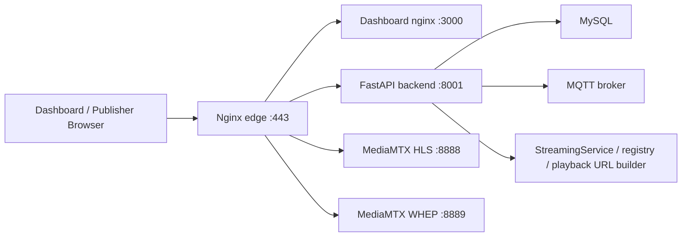

# GCS-Saker M2 통합 결과 보고 v0.1

작성일: 2026-05-27 KST

## 결론

M2 통합 PR 기준 브랜치는 `feature/issue-35-443-ingress`이고, GitHub PR은 #137 하나로 정리했다.

Server-01은 외부 `443/tcp` 포트포워딩 이후 `https://a4ai.tplinkdns.com/`로 접근 가능하다. 현재 인증서는 임시 자체서명 인증서이므로 브라우저에서 인증서 경고가 뜰 수 있다. 대시보드 확인은 가능하지만, 외부 노트북 카메라 publish까지 안정적으로 시험하려면 Let's Encrypt 같은 신뢰 인증서가 필요하다.

## 외부 접속 검증

검증 위치: 로컬 Mac에서 Server-01 public endpoint로 curl 실행

| 경로 | 결과 | 의미 | 총 소요 |
| --- | --- | --- | --- |
| `https://a4ai.tplinkdns.com/` | 200 | dashboard edge HTTPS 도달 | 21.2 ms |
| `https://a4ai.tplinkdns.com/api/v1/streams` | 401 | backend proxy 도달, 인증 필요 | 18.8 ms |
| `https://a4ai.tplinkdns.com/hls/nonexistent/index.m3u8` | 404 | MediaMTX HLS proxy 도달 | 50.9 ms |
| `https://a4ai.tplinkdns.com/webrtc/raw/local/webcam/whep` | 405 | MediaMTX WHEP signaling proxy 도달 | 20.4 ms |

Server-01 내부 IP는 `192.168.0.30/24`다. TP-Link 포트포워딩 기준 D값은 `30`이다.

## 현재 가능한 영역

### Dashboard

- 첫 화면이 landing page가 아니라 관제 dashboard shell로 동작한다.
- 자산 트리, 지도 placeholder, 선택 스트림, 다중 스트림 grid, 서버 상태, telemetry placeholder, AI 결과 placeholder가 있다.
- stream slot 장비 연결 popup, widget 추가/초기화/pin/popout UI 초안이 있다.
- stream 선택 시 map focus와 FOV placeholder가 변한다.
- `/?webcamPublisher=1`은 로그인 후 로컬 카메라 WebRTC publish 시험 페이지로 사용할 수 있다.

### Backend

- FastAPI 기반이다.
- 런타임은 Python `3.12`로 고정한다. `backend/.python-version`, `backend/pyproject.toml`, `backend/Dockerfile`, 계약 테스트가 같은 기준을 본다.
- `/healthz`, `/readyz`로 liveness/readiness를 분리했다.
- `/auth/signup`, `/auth/login`, `/auth/me`로 JWT 기반 인증 구조가 있다.
- `/api/v1/streams`, `/api/v1/streams/{streamId}/playback`으로 stream registry와 playback URL을 제공한다.
- viewer/operator role 기반 권한 분리가 적용되어 있다.
- MySQL, MQTT, MediaMTX와 Docker Compose로 함께 실행된다.

### Streaming

- MediaMTX `1.15.3`으로 image version을 고정했다.
- WHEP/WebRTC signaling은 `https://<host>/webrtc/...` 경유로 접근한다.
- HLS fallback은 `https://<host>/hls/...` 경유로 접근한다.
- WebRTC 실패 시 제한된 reconnect/backoff 후 HLS fallback으로 넘어가는 frontend 정책이 있다.
- 로컬 webcam WHIP publish 테스트 페이지가 있다.

### Infra/Ops

- Server-01은 `edge` Nginx가 외부 `443/tcp`를 단일 entrypoint로 받는다.
- dashboard, backend, MediaMTX, MQTT, MySQL 직접 포트는 host `127.0.0.1`에 묶었다.
- UFW는 SSH와 `443/tcp`만 허용한다.
- `.env.example`, `.env.staging.example`, `.env.production.example`로 환경 분리를 시작했다.
- Issue template, PR template, CODEOWNERS가 통합 PR에 포함되어 있다.

## 불안정하거나 아직 부족한 영역

### TLS와 브라우저 카메라 권한

현재는 자체서명 인증서다. 브라우저에서 dashboard 접근은 가능하지만, 다른 노트북에서 카메라 권한을 안정적으로 받으려면 신뢰 인증서가 필요하다. 특히 WebRTC publisher는 secure context를 요구하므로 Let's Encrypt 교체가 빠르게 필요하다.

### 저지연 성능 계측

외부 HTTPS/API/WHEP signaling 왕복은 측정했다. 하지만 실제 영상 입력부터 viewer 화면 첫 frame까지 걸리는 glass-to-glass latency는 아직 자동 측정되지 않았다. M2 통합 이후 가장 우선해야 할 시험이다.

### ICE/TURN

`8189/udp/tcp`는 아직 외부 공개하지 않았다. WHEP signaling은 443으로 도달하지만, 실제 WebRTC media path는 ICE candidate 상태에 따라 실패할 수 있다. 실패가 확인되면 `8189/udp`, 필요 시 `8189/tcp`를 조건부로 열거나 TURN relay를 구성해야 한다.

### 회원가입 UX

Backend signup API는 있으나 현재 dashboard의 주 라우팅에는 signup 화면이 연결되어 있지 않다. 운영자가 계정을 발급하거나, 임시로 `/auth/signup` API를 사용해야 한다. 민간 사용자 시험 전에는 invite code 기반 signup UI가 필요하다.

### Backend 운영 안정성

- stream registry는 현재 seed/in-memory 중심이다. DB 기반 stream/device registry로 이동해야 한다.
- Alembic 같은 DB migration 체계가 아직 없다.
- Backend CORS가 `allow_origins=["*"]`라 운영 도메인 기준으로 좁혀야 한다.
- telemetry/control/asset 일부는 legacy API와 신규 API 경계가 섞여 있다.
- MediaMTX 상태를 backend가 직접 관측하고 registry status에 반영하는 구조는 아직 약하다.
- 로컬 Mac의 기본 `python3`가 `3.14`일 경우 SQLAlchemy import 단계에서 실패한다. 이 실패는 애플리케이션 로직이 아니라 런타임 계약 위반이므로 backend 테스트는 Python `3.12` 또는 backend Docker container에서 실행해야 한다.

### 보안 표면

443을 열면 운영자 테스트 요청, 브라우저 preflight, 인터넷 스캐너 요청이 같은 edge access log에 섞인다. 단일 로그만으로 공격이라고 단정하지 않고 요청 경로, User-Agent, 반복 횟수, source IP를 함께 본다. 다만 현재 SPA fallback이 임의 경로에도 200을 줄 수 있으므로, 다음 hardening에서 rate limit, known-bad path 차단, access log 모니터링, fail2ban/nginx rule 연동을 해야 한다.

### Signalling 인증

WebRTC signalling은 모든 노트북, 로봇, 드론에 공개하면 안 된다. 사용자 브라우저는 로그인/JWT/권한으로 보호하고, 로봇/드론 같은 장비는 별도 device identity로 보호한다.

권장 구조:

- 사용자: 계정 로그인, role 기반 권한, stream view/publish 권한 검사
- 운영자 노트북 publisher: 로그인 후 임시 publish token 발급
- 로봇/드론: 사전 등록된 device ID, client credential 또는 device token, 필요 시 MAC 주소/serial fingerprint 보조 검증
- 서버: signalling proxy 진입 전에 stream ownership, device 등록 상태, token 만료, 허용된 stream path를 검사

MAC 주소는 네트워크 구간에 따라 직접 보이지 않거나 위조 가능하므로 단독 인증 수단으로 쓰지 않는다. MAC/serial은 장비 fingerprint 보조 정보로 두고, 실제 인증은 회전 가능한 secret/token 또는 mTLS/TURN credential로 구성한다.

## Backend 구조 평가

잘 된 점:

- HTTP ingress를 `edge` 하나로 모아 운영 표면이 단순하다.
- backend는 health/readiness, auth, stream API, module 구조가 분리되어 있다.
- streaming URL 생성 책임이 backend에 있어 frontend가 MediaMTX 내부 포트를 직접 알 필요가 줄었다.
- frontend streaming player는 WebRTC primary와 HLS fallback 정책을 분리해 장애 격리가 쉽다.

불안한 점:

- stream 상태가 MediaMTX 실제 publisher 상태와 강하게 동기화되어 있지 않다.
- DB schema migration, 계정 발급 운영 절차, 인증서 자동 갱신이 아직 약하다.
- 운영 관측 metric이 health/readiness 수준이고, latency, first-frame, ICE failure 같은 streaming 품질 지표가 없다.
- 현재 테스트 publisher는 개발용이다. 운영 모드에서는 권한, rate limit, stream ownership 검증이 필요하다.

## M2 이후 즉시 필요한 시험

1. 외부 노트북 camera WHIP publish
2. viewer 브라우저 WebRTC first frame 시간 측정
3. glass-to-glass latency 측정
4. ICE candidate 실패 여부 확인
5. HLS fallback 전환 시간 측정
6. 동시 viewer 수 증가 시 CPU/MEM/네트워크 영향 측정

세부 절차는 `docs/operations/GCS-Saker_스트리밍_저지연_시험계획_v0.1.md`를 기준으로 한다.
