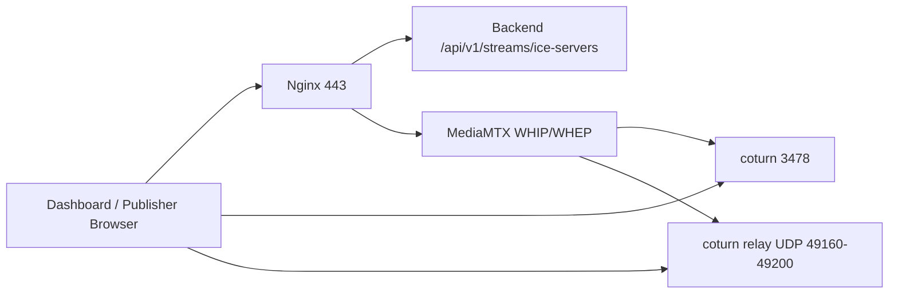

# GCS-Saker TURN 기본 구축 가이드 v0.1

## 목적

휴대폰, 외부 노트북, 현장 장비가 서로 다른 NAT 환경에 있을 때 STUN만으로 WebRTC ICE media path가 붙지 않을 수 있다. 이 경우 TURN은 미디어를 서버가 중계하게 만들어 송출/재생 성공률을 높인다.

## 운영 보안 기준

- 운영 coturn은 `4.17.2-r0`의 immutable multi-architecture digest를 사용한다.
- `allow-loopback-peers`는 사용하지 않으며 RFC1918 peer 대역과 multicast peer를 명시적으로 거부한다.
- 외부 WebRTC에서는 MediaMTX interface 후보 광고를 끄고 `turn.gcs-saker.com`만 additional host로 둔다.
- relay-only 검증은 local relay 후보와 public remote 후보만 남기고 selected pair가 relay인지 확인한다.
- 같은 coturn의 두 allocation을 연결할 때는 실행 중 TURN 컨테이너의 media-network IP 하나만
  `TURN_PRIMARY_ALLOWED_PEER_IP`로 허용하고, 재생성 후 실제 컨테이너 IP와 일치하는지 확인한다.

## 적용 구조



## 필요한 환경 변수

실제 값은 서버 `.env` 또는 secret store에만 둔다.

```bash
WEBRTC_STUN_URL=stun:stun.l.google.com:19302
WEBRTC_TURN_URL=turn:turn.gcs-saker.com:3478?transport=udp
WEBRTC_TURN_USERNAME=gcs-turn
WEBRTC_TURN_PASSWORD=<secret>
TURN_REALM=turn.gcs-saker.com
TURN_EXTERNAL_IP=<router-public-ip>
```

`TURN_EXTERNAL_IP`는 공유기에서 포워딩되는 공인 IP여야 한다. 서버가 NAT 뒤에 있으면 이 값이 틀릴 때 relay candidate가 사설 IP로 보일 수 있다.

## 실행

```bash
docker compose -f docker-compose.yml -f docker-compose.ice.example.yml --profile turn up -d turn mediamtx backend nginx edge
```

## 공유기 포트포워딩

기본 검증용 최소 포트:

| public port | target | 용도 |
| --- | --- | --- |
| 443/tcp | Server-01 edge | Dashboard, API, WHIP/WHEP signaling |
| 8189/udp,tcp | Server-01 MediaMTX | WebRTC direct ICE |
| 3478/udp,tcp | Server-01 coturn | TURN allocation |
| 49160-49200/udp | Server-01 coturn | TURN relay media |

TURN relay range는 운영 전 부하와 동시 세션 수에 맞춰 넓혀야 한다.

## 검증 순서

1. `docker compose config --quiet`
2. `docker compose ps turn mediamtx backend`
3. 로그인한 브라우저에서 `/api/v1/streams/ice-servers`가 STUN/TURN 목록을 반환하는지 확인
4. 휴대폰 `/publisher`에서 시그널링 단계가 `미디어 연결`을 지나 `송출 중`으로 바뀌는지 확인
5. Dashboard에서 `raw.local.webcam` 스트림이 online으로 잡히는지 확인

## 현재 한계

이번 구성은 정적 TURN credential을 사용한다. 운영 안정화 단계에서는 백엔드가 단기 credential을 발급하는 방식으로 바꾸는 것이 좋다.
