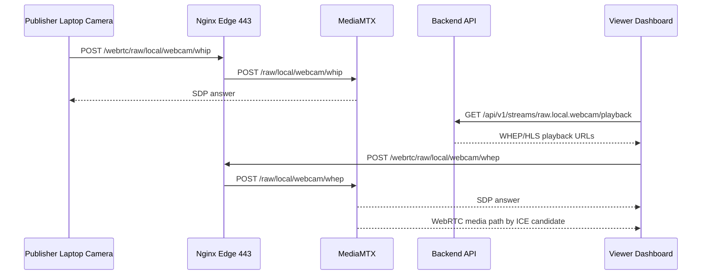

# GCS-Saker 스트리밍 저지연 시험 계획 v0.1

작성일: 2026-05-27 KST

## 목적

M2 통합 이후 가장 중요한 검증은 실제 stream 입력부터 viewer 화면 표시까지의 지연이다. 이 문서는 WebRTC primary, HLS fallback, backend playback API, Nginx edge, MediaMTX를 포함한 end-to-end 시험 기준을 정의한다.

## 측정해야 할 지표

| 지표 | 설명 | 목표 초안 |
| --- | --- | --- |
| `T_dashboard` | dashboard HTML 첫 응답 | p95 300 ms 이하 |
| `T_playback_api` | playback API 응답 | p95 200 ms 이하 |
| `T_whip_answer` | publisher WHIP offer POST 후 answer 수신 | p95 500 ms 이하 |
| `T_whep_answer` | viewer WHEP offer 후 answer 수신 | p95 500 ms 이하 |
| `T_first_frame` | viewer에서 재생 시작 후 첫 frame 표시 | 3 s 이하 |
| `T_glass_to_glass` | 카메라 앞 실제 변화가 viewer 화면에 보이는 시간 | LAN 800 ms 이하, WAN 1.5 s 이하 초안 |
| `T_fallback` | WebRTC 실패 후 HLS fallback 표시 | 6 s 이하 초안 |

HLS는 segment 기반이므로 WebRTC보다 늦다. 저지연 주 경로는 WebRTC다.

## 시험 구조

## 현재 edge 응답 기준선

외부에서 `https://a4ai.tplinkdns.com` 기준으로 확인한 값:

| 경로 | HTTP 상태 | 총 소요 |
| --- | --- | --- |
| `/` | 200 | 21.2 ms |
| `/api/v1/streams` | 401 | 18.8 ms |
| `/hls/nonexistent/index.m3u8` | 404 | 50.9 ms |
| `/webrtc/raw/local/webcam/whep` | 405 | 20.4 ms |

이 수치는 프록시/인증/signaling 경로가 살아있다는 의미다. 영상 지연 수치가 아니다.

## 수동 glass-to-glass 시험

### 준비

- Publisher 노트북: 카메라가 있는 장비
- Viewer 노트북: dashboard를 보는 장비
- 동일 네트워크 또는 외부망
- 가능하면 Let's Encrypt 인증서 적용 후 진행
- 임시 자체서명 인증서에서는 브라우저 카메라 권한이 제한될 수 있다.

### 절차

1. Publisher 노트북에서 `https://a4ai.tplinkdns.com/login` 접속 후 로그인한다.
2. 같은 브라우저에서 `https://a4ai.tplinkdns.com/?webcamPublisher=1` 접속한다.
3. `Start preview`를 눌러 카메라 권한을 허용한다.
4. `Publish WebRTC`를 누른다.
5. Viewer 노트북에서 `https://a4ai.tplinkdns.com/login` 접속 후 로그인한다.
6. dashboard에서 `raw.local.webcam` stream을 선택한다.
7. Viewer 화면에서 WebRTC mode와 첫 frame 표시 시간을 기록한다.
8. 카메라 앞에 millisecond stopwatch 또는 NTP 동기화된 시계를 띄우고 viewer 화면과 차이를 촬영해 `T_glass_to_glass`를 산출한다.

### 기록 양식

| 회차 | 네트워크 | publisher 브라우저 | viewer 브라우저 | first frame | glass-to-glass | ICE 상태 | fallback 여부 | 비고 |
| --- | --- | --- | --- | --- | --- | --- | --- | --- |
| 1 | LAN/WAN | Chrome/Safari | Chrome/Safari |  |  |  |  |  |

## 자동화해야 할 시험 구조

다음 개발 이슈에서 별도 구현한다.

- publisher page에 frame timestamp overlay 삽입
- viewer `RealtimePlayer`에서 `requestVideoFrameCallback` 기반 first frame 시간 기록
- browser performance mark로 `playback-api-start`, `whep-answer`, `first-frame` 기록
- `/api/v1/stream-tests/results` 같은 시험 결과 수집 API 추가
- Playwright로 publisher/viewer 두 browser context를 동시에 열어 자동 smoke 수행

## 실패 분리 기준

| 실패 | 원인 후보 | 확인 |
| --- | --- | --- |
| publisher preview 실패 | 브라우저 camera 권한, TLS 신뢰 문제 | 주소창 보안 상태, DevTools |
| WHIP publish 실패 | `/webrtc/.../whip` proxy, MediaMTX WHIP, CORS | edge log, MediaMTX log |
| playback API 401 | 로그인 token 없음 | localStorage token, `/auth/me` |
| WHEP answer 실패 | `/webrtc/.../whep` proxy, stream 미publish | edge log, MediaMTX path |
| ICE failed | `8189/udp/tcp` 미개방, NAT, TURN 없음 | `chrome://webrtc-internals` |
| HLS만 재생 | WebRTC media path 실패 | player mode, ICE candidate |

## 포트 정책

- 기본 public entrypoint는 계속 `443/tcp`다.
- `3000/tcp`, `8001/tcp`, `8888/tcp`, `8889/tcp`는 직접 공개하지 않는다.
- `8189/udp`, `8189/tcp`는 실제 ICE 실패가 확인된 뒤에만 조건부로 연다.
- TURN relay는 장기적으로 M5에서 credential/realm/relay range와 함께 구성한다.
